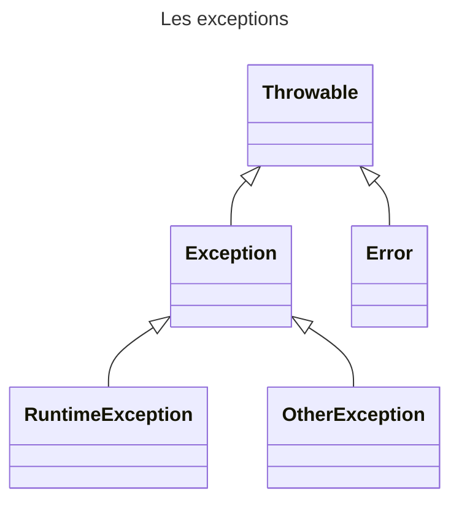

# Les Exceptions

## Introduction

Evénement intervenant lors de l’exécution d’un programme qui interrompt le flow
d’instructions normales d’un programme.


Les exceptions entraine une interruption dans le programme

En java, une **Exception** est une classe étendant la classe **Throwable**

## Classe Throwable

La classe **Throwable** est la classe de base de toutes les exceptions.




Les méthodes suivants sont disponibles :

| Méthode                | Description                                             |
|------------------------|---------------------------------------------------------|
| String getMessage()    | Retourne le message de l’exception                      |
| void printStackTrace() | Affiche l’exception avec l’état de la pile (« stack »). |
| Throwable getCause()   | Retourne l’origine de l’erreur                          |

## Classe Error

La classe **Error** est la classe représentant une erreur grave en provenance de la JVM ou d’un de ses composants

Cette erreur entraine un arrêt du programme


> Vous ne devez pas étendre de la classe Error

> Vous ne devez pas intercepter ces exceptions. Lorsqu'une exception de ce type est levée, votre application aura de forte chance d'être totalement instable.

## Classe RuntimeException

Le classe **RuntimeException** est la classe dont les exceptions ne sont pas obligatoirement interceptées par « try catch »

Ces exceptions peuvent être levées sans que la méthode l’indique via le
mot clé « throws ». 

On parle d’exception implicite

Exemple :
- NullPointerException
- ArrayIndexOutOfBoundsException


## Classe **Exception**
La classe **Exception** est la classe représentant les erreurs classiques remontées le plus souvent par les méthodes

Ces exceptions doivent être interceptées par le bloc « try catch »

## Créer son exception

Pour créer de nouvelles exceptions, il suffit d’étendre la classe **Exception**.
```java
package fr.epsi.exception;

public class UserNotFoundException extends Exception{
    public UserNotFoundException() {
        super("Utilisateur non trouvé");
    }

    public UserNotFoundException(Long identifer) {
        super("Utilisateur %d non trouvé".formatted(identifer));
    }
}
```

Par convention, les exceptions sont suffixées par le mot « Exception »


## Utilisation d'un exception : Le mot clé throws 

Pour indiquer qu’une méthode peut « lever » une exception, il faut utiliser le mot clé **throws** suivi de l'ensemble des exceptions pouvant être lévées.
Les exceptions sont séparées par une virgule. Ce mot clé est à possitionner à la suite des paramaétres de la méthode.

Pour lever l’exception, le mot clé « throw » doit être utilisé suivi d’une instance de la classe d’exception.

La levée de l’exception entraine une interruption de la méthode.

Dans le cas de l'exemple suivant, on constate que dans le cas où l'utilisateur n'est pas trouvé, l'exception **UserNotFoundException** sera levée par la méthode.

Fichier [UserService](src/main/java/fr/epsi/service/UserService.java)

```java 
public class UserService {

    private Map<Long, User> users = Map.of(
            1l, new User(1l, "Donald", "Duck"),
            2l, new User(2l, "Mickey", "Mouse"),
            3l, new User(3l, "Peter", "Pan"),
            4l, new User(4l, "Mini", "Mouse")
    );

    public User findUserById(Long identifier) throws UserNotFoundException{
        User user = this.users.get(identifier);
        if(user == null) {
            throw new UserNotFoundException(identifier);
        }
        return user;
    }

}
```

> Lorsque vous réalisez des classes d'exception, n'oubliez pas de passer dans le/les constructeurs des élements qui permettront de comprendre facilement le probléme.

## Intercepter une exception

Toute exception n’étendant ni **RuntimeException**, ni **Error** doit être interceptée par un bloc **try catch**.

En appelant méthode **findUserById**, l'exemple suivant gére l'exception **UserNotFoundException**

Fichier [Main](src/main/java/fr/epsi/Main.java)

```java
package fr.epsi;

import fr.epsi.exception.UserNotFoundException;
import fr.epsi.service.UserService;

public class Main {

    public static void main(String[] args) {
        var userService = new UserService();

        try {
            var user = userService.findUserById(1L);
            System.out.println("Utilisateur : " + user);

            var otherUser = userService.findUserById(20L);
            System.out.println("Utilisateur : " + otherUser);
        } catch (UserNotFoundException e) {
            System.err.println(e.getMessage());
        }
    }
}
```

Il est possible d'intercepter plusieurs exceptions de 2 manières différents.

Soit en appliquant plusieurs catch à la suite si l'on souhaite réaliser des traitements en fonction des exceptions levées.

Fichier [Main](src/main/java/fr/epsi/Main2.java)

```java
package fr.epsi;

import fr.epsi.exception.UserNotFoundException;
import fr.epsi.service.UserService;

public class Main2 {

    public static void main(String[] args) {
        var userService = new UserService();

        try {
            var user = userService.findUserById(1L);
            System.out.println("Utilisateur : " + user);

            var otherUser = userService.findUserById(20L);
            System.out.println("Utilisateur : " + otherUser);
        } catch (UserNotFoundException e) {
            System.err.println(e.getMessage());
        } catch(NullPointerException e){
            System.err.println("Exception qui n'aurait pas du être levée. Message : " + e.getMessage());
        }
    }
}
```

```shell
mvn --quiet compile exec:java -Dexec.mainClass=fr.epsi.Main2
Utilisateur : User[identifier=1, firstname=Donald, lastname=Duck]
Utilisateur 20 non trouvé
```

Soit en séparant les exceptions par un pipe |. On ne dissocie plus le traitement à réaliser en fonction de l'sxception.

Fichier [Main](src/main/java/fr/epsi/Main3.java)

```java
package fr.epsi;

import fr.epsi.exception.UserNotFoundException;
import fr.epsi.service.UserService;

public class Main3 {

    public static void main(String[] args) {
        var userService = new UserService();

        try {
            var user = userService.findUserById(1L);
            System.out.println("Utilisateur : " + user);

            var otherUser = userService.findUserById(20L);
            System.out.println("Utilisateur : " + otherUser);
        } catch (UserNotFoundException|NullPointerException e) {
            System.err.println(e.getMessage());
        } 
    }
}
```

```shell
mvn --quiet compile exec:java -Dexec.mainClass=fr.epsi.Main3
Utilisateur : User[identifier=1, firstname=Donald, lastname=Duck]
Utilisateur 20 non trouvé
```

## Le mot clé **finally**

Il est parfois nécessaire de réaliser un traitement spécifique qu'une exception soit levée ou non. 

Le mot clé **finally** permet ainsi d'introduire un bloc d'instructions qui sera **toujours** réalisé au sein d'un bloc **try...catch**. 

> Par exemple, imaginons que nous réalisons le parcours d'un fichier. Il sera nécessaire de fermer celui-ci en fin de traitement. 

```java
package fr.epsi;

import fr.epsi.domain.User;
import fr.epsi.exception.UserNotFoundException;
import fr.epsi.service.UserService;

public class Main4 {

    public static void main(String... args) throws Exception{
        UserService userService = new UserService();
        try {
            User user = userService.findUserById(20L);
        }catch(UserNotFoundException e) {
            System.out.println("Exception remontée");
            System.out.println(e.getMessage());
            throw e;
        } finally {
            System.out.println("Traitement finally en cours");
        }
    }
}
```

```shell
mvn --quiet compile exec:java -Dexec.mainClass=fr.epsi.Main4
Exception remontée
Utilisateur 20 non trouvé
Traitement finally en cours
Exception in thread "main" fr.epsi.exception.UserNotFoundException: Utilisateur 20 non trouvé
	at fr.epsi.service.UserService.findUserById(UserService.java:20)
	at fr.epsi.Main4.main(Main4.java:12)
```


## L'interface AutoCloseable

Comme vu en introduction, la classe **Object** propose la méthode **finalize** appelée lors destruction de l'instance.

L'appel à cette méthode est totalement imprévisible. L'appel sera réalisée uniquement lors d'un passage du garbage collector lorsque la jvm détecte la nécessité de libérer de la mémoire (dans la seconde ou voir plusieurs minutes après l'utilisation de l'instance).

Afin de controler# Les Exceptions

## Introduction

Evénement intervenant lors de l’exécution d’un programme qui interrompt le flow
d’instructions normales d’un programme.


Les exceptions entraine une interruption dans le programme

En java, une **Exception** est une classe étendant la classe **Throwable**

## Classe Throwable

La classe **Throwable** est la classe de base de toutes les exceptions.


Les méthodes suivants sont disponibles :

| Méthode                | Description                                             |
|------------------------|---------------------------------------------------------|
| String getMessage()    | Retourne le message de l’exception                      |
| void printStackTrace() | Affiche l’exception avec l’état de la pile (« stack »). |
| Throwable getCause()   | Retourne l’origine de l’erreur                          |

## Classe Error

La classe **Error** est la classe représentant une erreur grave en provenance de la JVM ou d’un de ses composants

Cette erreur entraine un arrêt du programme


> Vous ne devez pas étendre de la classe Error

> Vous ne devez pas intercepter ces exceptions. Lorsqu'une exception de ce type est levée, votre application aura de forte chance d'être totalement instable.

## Classe RuntimeException

Le classe **RuntimeException** est la classe dont les exceptions ne sont pas obligatoirement interceptées par « try catch »

Ces exceptions peuvent être levées sans que la méthode l’indique via le
mot clé « throws ».

On parle d’exception implicite

Exemple :
- NullPointerException
- ArrayIndexOutOfBoundsException


## Classe **Exception**
La classe **Exception** est la classe représentant les erreurs classiques remontées le plus souvent par les méthodes

Ces exceptions doivent être interceptées par le bloc « try catch »

## Créer son exception

Pour créer de nouvelles exceptions, il suffit d’étendre la classe **Exception**.
```java
package fr.epsi.exception;

public class UserNotFoundException extends Exception{
    public UserNotFoundException() {
        super("Utilisateur non trouvé");
    }

    public UserNotFoundException(Long identifer) {
        super("Utilisateur %d non trouvé".formatted(identifer));
    }
}
```

Par convention, les exceptions sont suffixées par le mot « Exception »


## Utilisation d'un exception : Le mot clé throws

Pour indiquer qu’une méthode peut « lever » une exception, il faut utiliser le mot clé **throws** suivi de l'ensemble des exceptions pouvant être lévées.
Les exceptions sont séparées par une virgule. Ce mot clé est à possitionner à la suite des paramaétres de la méthode.

Pour lever l’exception, le mot clé « throw » doit être utilisé suivi d’une instance de la classe d’exception.

La levée de l’exception entraine une interruption de la méthode.

Dans le cas de l'exemple suivant, on constate que dans le cas où l'utilisateur n'est pas trouvé, l'exception **UserNotFoundException** sera levée par la méthode.

Fichier [UserService](src/main/java/fr/epsi/service/UserService.java)

```java 
public class UserService {

    private Map<Long, User> users = Map.of(
            1l, new User(1l, "Donald", "Duck"),
            2l, new User(2l, "Mickey", "Mouse"),
            3l, new User(3l, "Peter", "Pan"),
            4l, new User(4l, "Mini", "Mouse")
    );

    public User findUserById(Long identifier) throws UserNotFoundException{
        User user = this.users.get(identifier);
        if(user == null) {
            throw new UserNotFoundException(identifier);
        }
        return user;
    }

}
```

> Lorsque vous réalisez des classes d'exception, n'oubliez pas de passer dans le/les constructeurs des élements qui permettront de comprendre facilement le probléme.

## Intercepter une exception

Toute exception n’étendant ni **RuntimeException**, ni **Error** doit être interceptée par un bloc **try catch**.

En appelant méthode **findUserById**, l'exemple suivant gére l'exception **UserNotFoundException**

Fichier [Main](src/main/java/fr/epsi/Main.java)

```java
package fr.epsi;

import fr.epsi.exception.UserNotFoundException;
import fr.epsi.service.UserService;

public class Main {

    public static void main(String[] args) {
        var userService = new UserService();

        try {
            var user = userService.findUserById(1L);
            System.out.println("Utilisateur : " + user);

            var otherUser = userService.findUserById(20L);
            System.out.println("Utilisateur : " + otherUser);
        } catch (UserNotFoundException e) {
            System.err.println(e.getMessage());
        }
    }
}
```

Il est possible d'intercepter plusieurs exceptions de 2 manières différents.

Soit en appliquant plusieurs catch à la suite si l'on souhaite réaliser des traitements en fonction des exceptions levées.

Fichier [Main](src/main/java/fr/epsi/Main2.java)

```java
package fr.epsi;

import fr.epsi.exception.UserNotFoundException;
import fr.epsi.service.UserService;

public class Main2 {

    public static void main(String[] args) {
        var userService = new UserService();

        try {
            var user = userService.findUserById(1L);
            System.out.println("Utilisateur : " + user);

            var otherUser = userService.findUserById(20L);
            System.out.println("Utilisateur : " + otherUser);
        } catch (UserNotFoundException e) {
            System.err.println(e.getMessage());
        } catch(NullPointerException e){
            System.err.println("Exception qui n'aurait pas du être levée. Message : " + e.getMessage());
        }
    }
}
```

```shell
mvn --quiet compile exec:java -Dexec.mainClass=fr.epsi.Main2
Utilisateur : User[identifier=1, firstname=Donald, lastname=Duck]
Utilisateur 20 non trouvé
```

Soit en séparant les exceptions par un pipe |. On ne dissocie plus le traitement à réaliser en fonction de l'sxception.

Fichier [Main](src/main/java/fr/epsi/Main3.java)

```java
package fr.epsi;

import fr.epsi.exception.UserNotFoundException;
import fr.epsi.service.UserService;

public class Main3 {

    public static void main(String[] args) {
        var userService = new UserService();

        try {
            var user = userService.findUserById(1L);
            System.out.println("Utilisateur : " + user);

            var otherUser = userService.findUserById(20L);
            System.out.println("Utilisateur : " + otherUser);
        } catch (UserNotFoundException|NullPointerException e) {
            System.err.println(e.getMessage());
        } 
    }
}
```

```shell
mvn --quiet compile exec:java -Dexec.mainClass=fr.epsi.Main3
Utilisateur : User[identifier=1, firstname=Donald, lastname=Duck]
Utilisateur 20 non trouvé
```

## Le mot clé **finally**

Il est parfois nécessaire de réaliser un traitement spécifique qu'une exception soit levée ou non.

Le mot clé **finally** permet ainsi d'introduire un bloc d'instructions qui sera **toujours** réalisé au sein d'un bloc **try...catch**.

> Par exemple, imaginons que nous réalisons le parcours d'un fichier. Il sera nécessaire de fermer celui-ci en fin de traitement.

Fichier [Main4](src/main/java/fr/epsi/Main4.java)

```java
package fr.epsi;

import fr.epsi.domain.User;
import fr.epsi.exception.UserNotFoundException;
import fr.epsi.service.UserService;

public class Main4 {

    public static void main(String... args) throws Exception{
        UserService userService = new UserService();
        try {
            User user = userService.findUserById(20L);
        }catch(UserNotFoundException e) {
            System.out.println("Exception remontée");
            System.out.println(e.getMessage());
            throw e;
        } finally {
            System.out.println("Traitement finally en cours");
        }
    }
}
```

```shell
mvn --quiet compile exec:java -Dexec.mainClass=fr.epsi.Main4
Exception remontée
Utilisateur 20 non trouvé
Traitement finally en cours
Exception in thread "main" fr.epsi.exception.UserNotFoundException: Utilisateur 20 non trouvé
	at fr.epsi.service.UserService.findUserById(UserService.java:20)
	at fr.epsi.Main4.main(Main4.java:12)
```


## L'interface AutoCloseable

Comme vu en introduction, la classe **Object** propose la méthode **finalize** appelée lors destruction de l'instance.

L'appel à cette méthode est totalement imprévisible. L'appel sera réalisée uniquement lors d'un passage du garbage collector lorsque la jvm détecte la nécessité de libérer de la mémoire (dans la seconde ou voir plusieurs minutes après l'utilisation de l'instance).

Imaginons que l'instance libére un fichier, cette libération sera réalisée que plus tard aprés usage si nous décidions de le réaliser dans la méthode **finalize**.

Une ancienne technique consiste à réaliser cette libération au sein du bloc d'instructions **finally**.

Une autre technique consiste à déclarer l'instance entre parenthéses au niveau du **try**. 
La classe de l'instance doit dans ce cas implémentée l'interface **AutoCloseable** et ainsi fournir une implémentation à la méthode **close**. 
La JVM appelera automatiquement la méthode **close**

Fichier [MyResource](src/main/java/fr/epsi/MyResource.java)

```java
package fr.epsi;
public class MyResource implements AutoCloseable{
    public void doStuff(){
        System.out.println("Je travaille....");
    }
    @Override
    public void close() {
        System.out.println("Good bye ! J'ai libéré des ressources");
    }
}
```

Fichier [Main5](src/main/java/fr/epsi/Main5.java)
```java
package fr.epsi;

public class Main5 {

    public static void main(String[] args) {
        try (var resource = new MyResource()) {
            resource.doStuff();
        }
    }
}
```

```shell
mvn --quiet compile exec:java -Dexec.mainClass=fr.epsi.Main5
Je travaille....
Good bye ! J'ai libéré des ressources
```