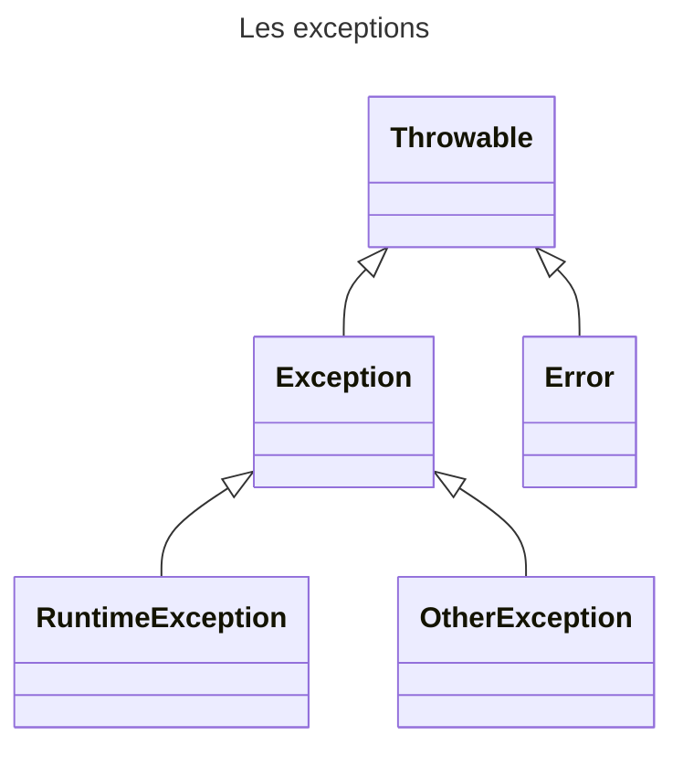

# Les Exceptions

## Introduction

Evénement intervenant lors de l’exécution d’un programme qui interrompt le flow
d’instructions normales d’un programme.


Les exceptions entraine une interruption dans le programme

En java, une **Exception** est une classe étendant la classe **Throwable**

## Classe Throwable

La classe **Throwable** est la classe de base de toutes les exceptions.




Les méthodes suivants sont disponibles :

| Méthode                | Description                                             |
|------------------------|---------------------------------------------------------|
| String getMessage()    | Retourne le message de l’exception                      |
| void printStackTrace() | Affiche l’exception avec l’état de la pile (« stack »). |
| Throwable getCause()   | Retourne l’origine de l’erreur                          |

## Classe Error

La classe **Error** est la classe représentant une erreur grave en provenance de la JVM ou d’un de ses composants

Cette erreur entraine un arrêt du programme


> Vous ne devez pas étendre de la classe Error

> Vous ne devez pas intercepter ces exceptions. Lorsqu'une exception de ce type est levée, votre application aura de forte chance d'être totalement instable.

## Classe RuntimeException

Le classe **RuntimeException** est la classe dont les exceptions ne sont pas obligatoirement interceptées par « try catch »

Ces exceptions peuvent être levées sans que la méthode l’indique via le
mot clé « throws ». 

On parle d’exception implicite

Exemple :
- NullPointerException
- ArrayIndexOutOfBoundsException


## Classe **Exception**
La classe **Exception** est la classe représentant les erreurs classiques remontées le plus souvent par les méthodes

Ces exceptions doivent être interceptées par le bloc « try catch »

## Créer son exception

Pour créer de nouvelles exceptions, il suffit d’étendre la classe **Exception**.
```java
package fr.epsi.exception;

public class UserNotFoundException extends Exception{
    public UserNotFoundException() {
        super("Utilisateur non trouvé");
    }

    public UserNotFoundException(Long identifer) {
        super("Utilisateur %d non trouvé".formatted(identifer));
    }
}
```

Par convention, les exceptions sont suffixées par le mot « Exception »


## Utilisation d'un exception : Le mot clé throws 

Pour indiquer qu’une méthode peut « lever » une exception, il faut utiliser le mot clé **throws** suivi de l'ensemble des exceptions pouvant être lévées.
Les exceptions sont séparées par une virgule. Ce mot clé est à possitionner à la suite des paramaétres de la méthode.

Pour lever l’exception, le mot clé « throw » doit être utilisé suivi d’une instance de la classe d’exception.

La levée de l’exception entraine une interruption de la méthode.

Dans le cas de l'exemple suivant, on constate que dans le cas où l'utilisateur n'est pas trouvé, l'exception **UserNotFoundException** sera levée par la méthode.

```java 
public class UserService {

    private Map<Long, User> users = Map.of(
            1l, new User(1l, "Donald", "Duck"),
            2l, new User(2l, "Mickey", "Mouse"),
            3l, new User(3l, "Peter", "Pan"),
            4l, new User(4l, "Mini", "Mouse")
    );

    public User findUserById(Long identifier) throws UserNotFoundException{
        User user = this.users.get(identifier);
        if(user == null) {
            throw new UserNotFoundException(identifier);
        }
        return user;
    }

}
```

