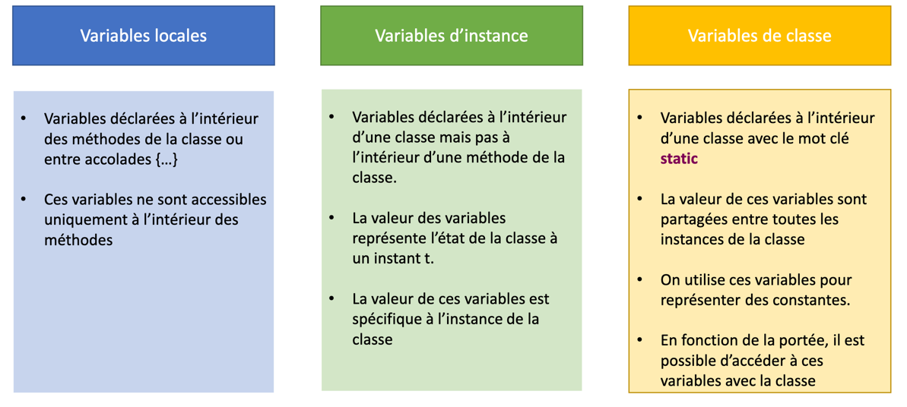
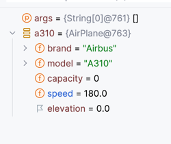
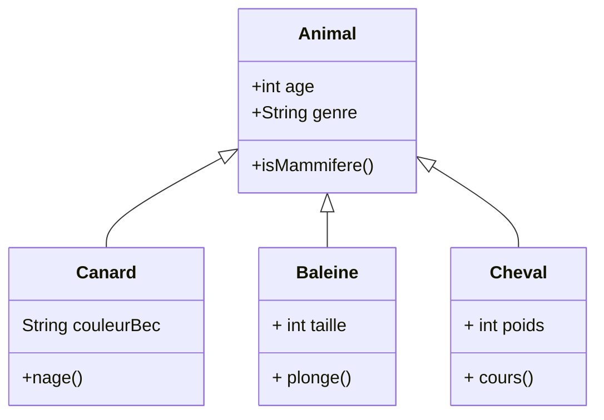

# Programmation Orientée Objet

La programmation Orientée Objet est une des concepts principaux du langage Java.

La réalisation de classe est la principale possibilité offerte par le langage pour définir de nouveaux types.


## Qu'est ce qu'une classe ? 

Une classe peut être assimilée à un plan logiciel ou à un prototype pour les objets. 
Elle définie les élements qui donneront une existence à un objet. 

On y trouvera : 
- des propriétés
- des méthodes pour manipuler ces propriétés.

Les propriétés seront un ensemble de variables typés qui poséderont des valeurs variant tout le long du cyle de vie de l'objet. 
**Les valeurs des propriétés représentent l'état de l'objet**

Les méthodes permettent d'accéder aux propriétés, de modifier leur valeur ou de réaliser un comportenement en manipulant l'ensemble des valeurs des propriétés.

La classe en tant que telle n'a pas d'existance réelle. Pour donner vie à une classe et l'attribuer à des variables, il faut créer une instance de celle-ci, c'est à dire créer un **objet**.


### Définir une classe

Pour définir une classe,  
- une classe est dans un fichier portant le même nom
- son nom commence par un majuscule et respecte le format pascalCase.
- elle est définie par le mot clé **class**
- elle posséde des propriétés, des constructeurs et des méthodes.

```java
public class AirPlane {

    // 1 déclaration des attributs / propriété
    private String brand;
    private String model;
    private int capacity;
    private double speed;
    private double elevation;

    //Les méthodes
    public void decelerate(double speeValued) {
        if (this.speed - speeValued > 0) {
            this.speed -= speeValued;
        }
    }

    public void accelerate(double speeValued) {
        this.speed += speeValued;
    }
}

```

### Les variables

Elément « nommé » permettant de stocker des informations sur la classe ou sur l’instance de la classe (objet)

Le tableau suivant présente les types de variables que vous pouvez rencontrer dans une classe.



Concernant les variables d'instances, chaque instance possédera « ses » propres valeurs pour chaque propriété

> Pour créer une instance, il faut utiliser le mot clé **new** 

### Les contructeurs

Un constructeur est un bloc d'instructions permettant d'initialiser une nouvelle instance d'une classe.

Un constructeur : 
- porte le **même nom que la classe**
- retourne aucun type. 
- accéde au mot clé **this** qui représente l'instance de la classe
- sert à configurer l'état intial de l'instance

Une classe peut ne pas avoir de constructeur. Dans ce cas, Java configure automatiquement un constructeur par défaut ne réalisant aucun traitement. 
Les propriétés de l'insstance seront initalisées par les valeurs par défaut.

Dés qu'un constructeur est défini, le constructeur par défaut n'est plus accéssible.

On peut définir autant de constructeurs que l'on souhaite. La différence se fera sur le nombre et le type des paramétres les définisant.

Pour notre classe **AirPlane**, le constructeur suivant initialisera la marque et le modele. Quant aux autres propriétés (speed...), elles seront initialisées par les valeurs par défaut.


```java
 public AirPlane(String brand, String model) {
        this.brand = brand;
        this.model = model;
    }
```


> le mot clé **this** permet d'accéder à l'instance de la classe c'est à dire à l'objet que nous sommes entrain d'initialiser. Suivi du **.**, il permet d'accéder aux propriétés et au méthodes de l'instance.
> le mot clé **this** sera disponible dés que l'on accéder à des méthodes d'instance.

La création d'une instance se fera par l'utilisation du mot clé **new** suivi du contructeur souhaité.

L'exemple suivant permet de définir 2 variables : a310 et b77. Ces 2 variables sont du type **AirPlane**.
Puis, nous initialisons les variables en appelant le contructeur prenant la marque et le modéle.

```java
public class Main1 {

    public static void main(String[] args) {
        AirPlane a310 = new AirPlane("Airbus", "A310");
        AirPlane b777 = new AirPlane("Boeing", "B777");
    }
}
```
Le mode débug de l'IDE permet de visualer ces 2 instances avec leurs propriétés respectives.


Le tableau suivant synthétise les 3 types de constructeurs :


Il est tout à fait possible de déclarer autant de constructeurs que l'on souhaite.
Il s'agit du principe de l'overloading.

En ajoutant un constructeur avec uniquement la marque, nous pouvons créer des instances à partir de ce dernier.

```java
public AirPlane(String brand) {
    this.brand = brand;
}
```

```java
public class Main2 {

    public static void main(String[] args) {
        AirPlane a310 = new AirPlane("Airbus", "A310");
        AirPlane b777 = new AirPlane("Boeing");
    }
}
```

Le mode débug permet de visualiser que la variable *b777* ne posséde que la marque.


### Les méthodes

Les méthodes d'instance vont permette d'accéder à notre objet afin qu'il réalise un traitement. Ce traitement pourra modifier l'état de notre objet via la modification de la valeur des propriétés d'instance.

> L'accés à ces méthode se fera en utilisant le point.

L'exemple présente 2 méthodes qui vont agir sur la vitesse de l'instance.

```java
  public void decelerate(double speeValued) {
        if (this.speed - speeValued > 0) {
            this.speed -= speeValued;
        }
    }

    public void accelerate(double speeValued) {
        this.speed += speeValued;
    }
```


```java
public class Main3 {

    public static void main(String[] args) {
        AirPlane a310 = new AirPlane("Airbus", "A310");
        a310.accelerate(200);
        a310.decelerate(20);
    }
}
```

Le tableau montre l'évolution de la vitesse de l'instance **a310**.

 Etat 1                   | Etat 2                                    | Etat 3                                    |
 -------------------------|-------------------------------------------|-------------------------------------------|
 |  | 

### Les accesseurs

La POO répose sur le principe d'encapsulation. 
Ce principe permet de masquer les détails d’un objet à un client. Afin d’accéder
aux propriétés, des méthodes d’accés sont créées afin de retourner ou de modifier
les propriétés de l’instance

Ainsi, 
* Les propriétés sont **privée** le plus souvent. Lors de leur déclaration, les propriétés de la classe sont préfixés par **private**. 
* Les propriétés privées ne sont accessible que les méthodes de l'instance
* L'accés et la modification des valeurs des propriétés seront le plus souvent réalisé par des méthodes appelées **getter** et **setter**.

En complétant la classe **AirPlane**, l'ajout d'un getter et d'un setter sur la propriété **model** permet de lui associer une valeur et d'y accéder.

```java
    public void setModel(String model) {
        this.model = model;
    }


    public int getCapacity() {
        return capacity;
    }
```

```java
public class Main4 {

    public static void main(String[] args) {
        AirPlane b777 = new AirPlane("Boeing");
        b777.setModel("B777");
        System.out.println("L'instance b777 est associé au modele : " + b777.getModel());
    }
}
```

```java
mvn --quiet compile exec:java -Dexec.mainClass=Main4
L'instance b777 est associé au modele : B777
```

Une erreur serait de mettre des setter sur toutes les classes. 
Hors, certaines propriétés ne doivent pas être modifiées sans contrôle.
Par exemple, la propriété **speed** ne doit être modifiée directement vu qu'elle est controlée par les méthodes **accelerate** et **decelerate**.

On prefera donc ne permettre simplement la récupération de la valeur de la propriété **speed**.

```java
public double getSpeed() {
    return speed;
}
```

```java
public class Main5 {

    public static void main(String[] args) {
        AirPlane a310 = new AirPlane("Airbus", "A310");
        a310.accelerate(200);
        a310.decelerate(20);
        System.out.printf("Avion %s %s a une vitesse de %.2f \n", a310.getBrand(), a310.getModel(), a310.getSpeed());
    }
}
```

```java
mvn --quiet compile exec:java -Dexec.mainClass=Main5
L'instance b777 est associé au modele : B777
```

## L'héritage

L'héritage est la capacité d'une classe  d’être créée à partir d’une autre classe en l’étendant.
Ce principe permet d'éviter de dupliquer le code et de factoriser le code en commun dans une classe dite mère.

Les classes héritantes d'une autre classe héritent des comportements de la classe héritée. 

Les classes héritante sont dites des classes filles et peuvent définir : 
- de nouvelles propriétés
- de nouvelles méthodes.

Les classes fille peuvent également modifier le comportement de la classe mère en redefinissant les méthodes de la classe mère (**overriding**)

Exemple d'héritage : 




### Comment hériter ? 

En Java, une classe peut hériter d'une autre classe en utilisant le mot clé **extends**.
Le mot clé **extends** se place aprés le nom de classe et est suivi du nom de classe mère.

> Attention, une classe **ne peut hériter que d'une seule classe !**

Dans le cas des animaux : 


```java 
public class Animal  {

    private int age;
    private String genre;

    public boolean isMammifere(){
        return false;
    }
}

public class Baleine extends Animal{
    private int taille;
    
    public void plonge(){

    }
}
```

Ici, nous constatons que la classe Baleine représente un mammifére. 
La méthode **isMammifere** de la classe doit être redefinie dans la classe **Baleine**.

Ainsi, la classe **Baleine** devient : 

```java
public class Baleine extends Animal{

    private int taille;

    public void plonge(){
    }

    @Override
    public boolean isMammifere() {
        return true;
    }
}
```

> Ici, vous voyez apparaitre l'annotation @override. Les annotations sont énormément utilisées dans le cadre de développement d'applications d'entreprise. Elles permettent d'ajouter des comportements transverses sans que vous soyez obligés de coder.
> L'annotation @override est purement indicative et n'a aucun apport lors de l'exécution.


## Le mot clé **abstract**

Dans l'exemple ci dessus, aucun obligation n'a été imposé quant à la redéfinition de la méthode **isMammifere**. 
La classe **Balein** aurait très bien pu ne pas redéfinir cette méthode et d'un point de vue compilation et éxecution, aucune erreur n'aurait été rencontrée.

Et pourtant, conceptuellement, une **baleine** est un mammifère.

Le moté clé **abstract** permet de forcer la redefinition des méthodes dites abstraites par les classes héritantes.
Il doit être possitionné avec le mot clé **class** de la classe mère puis peut être utilisé lors de la déclaration de certaines méthodes. 

Ces méthodes abstraites ne fourniront aucun bloc de code dans la classe. Seule la siganture sera définie (ce que la méthode retourne et ce qu'elle prend en paramétre).

Les classes **fille** **devront** implémenter les méthodes abstraites. C'est à dire fournir un bloc d'instructions.

Voici la nouvelle déclaration de la classe **Animal** : 

```java 
public abstract class Animal  {

    private int age;
    private String genre;

    public abstract boolean isMammifere();
}
```

Si nous ne faisons aucune autre modification, le projet ne compile plus.


Il est nécessaire de définir une implémentation de cette méthode dans les classes **Cheval** et **Canard**

```java
public class Cheval extends Animal{
    private int poids;

    @Override
    public boolean isMammifere() {
        return true;
    }
}

public class Canard extends Animal {

    private String couleurBec;

    public void nage() {
    }

    @Override
    public boolean isMammifere() {
        return false;
    }
}
```

## Le mot clé final.

La méthode **isMammifere** va devoir être implémtée dans l'ensemble des classes représentant des animaux. 
Dans notre exemple, les classes **Cheval** et **Baleine** représentent des animaux tous 2 des mammiféres et potentiellement partageant des caractèristiques communes.

Ainsi, une nouvelle classe **Mammifere** peut être réalisé afin de regrouper les mammiféres entre eux.


Le nouveau diagramme de classe présente le nouvel arbre d'héritage.

Dés lors, la méthode  **isMammifere** sera définie dans la classe **Mammifere** et ne devra plus être redéfinie par les classes héritant de la classe **Mammifere**.

Pour éviter qu'une méthode ne soit redéfinie, il suffit de la faire précéder par le mot clé **final**. Le mécanisme d'**overrriding** ne pourra plus avoir lieu.

La classe **Mammifere** devient : 

```java
public class Mammifere extends Animal{
    @Override
    public final boolean isMammifere() {
        return false;
    }
}
```

Si nous changeons l'heritage sur la classe **Baleine** en laissant la méthode **isMammifere**.

```java
public class Mammifere extends Animal{
    @Override
    public final boolean isMammifere() {
        return true;
    }
}
```


La classe **Baleine** doit devenir : 

```java
public class Baleine extends Mammifere{

    private int taille;

    public void plonge(){
    }

}

```