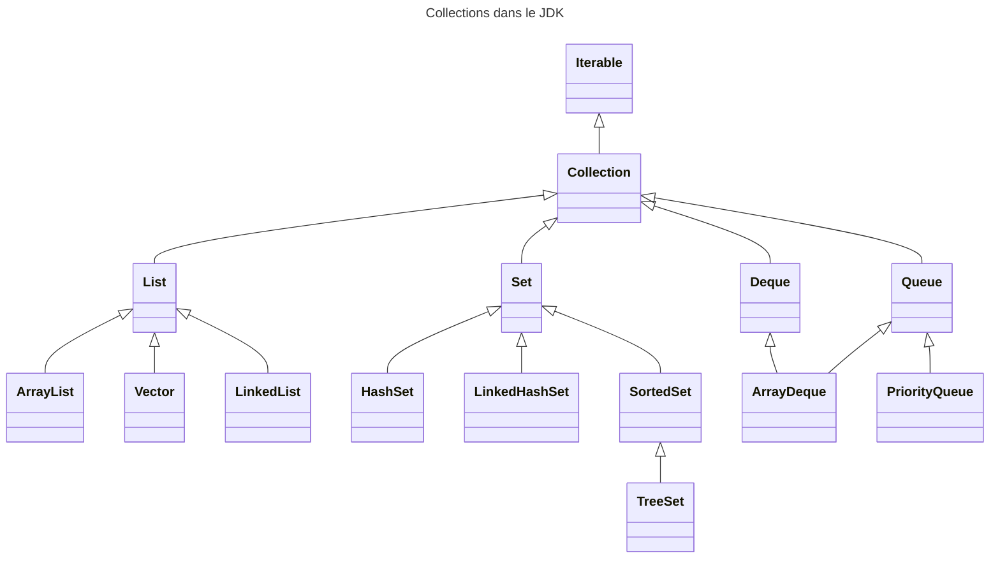

# Les collections

-----

## Qu'est ce qu'une collection ? 

Une collection est une structure de données permettant de regrouper un
ensemble d’objets.

Une collection peut etre comparée à un tableau avec des avantages indéniables : 
- aucune contrainte de taille. La liste s'adapte automatiquement en cachant la complexité sous jacente.
- de nombreuses méthodes permettant de manipuler les élements de la collection.
  - Ajout, suppression, recherche
  - Parcours
  - Tri

Les classes permettant de créer des collections sont essentiellement dans le package *java.util*.

Le JDK fournit diverses implémentations répondant à des besoins différents et adaptés à des contextes d'utilisation.



## Les grandes familles de collections

| List                                                           | Set                                                       | Queue
|----------------------------------------------------------------|-----------------------------------------------------------|-------------------------------------
| *java.util.List*                                               | *java.util.Set*                                           | *java.util.Queue*
| Liste ordonnée d’objets                                        | Liste non ordonnée d’objets                               | Liste ordonnée d’objets type FIFO
| Possibilité d’avoir des  doublons                              | Aucun doublon                                             | Possibilité d’avoir desdoublons
| Possibilité de placer un élément à un index précis de la liste | Pas possibilité de placer un élément à l’endroit souhaité | Tout nouvel élément est placé à la fin de la liste
| Accès possible à un élément par son index                      |                                                           | Accès uniquement au premier élément

### L'interface List

3 implémentations principalement utilisées :

* ArrayList<E>
  * Bonne performance en  accès get / set
  * **Classe la plus utilisée**
  

* LinkedList<E>
  * Bonne performance en accès add / remove
  * Performance médiocre en accès get / set


* Vector<E>
  * Toutes les méthodes sont synchronisées
  * Performance médiocre
  * **Classe à ne plus utiliser**

Quelques méthodes fréquemment utilisées : 

| Methode                                | Description                                                        |
|----------------------------------------|--------------------------------------------------------------------|
| `boolean add(E e)`                     | Permet d’ajouter un élément                                        | 
| `void add(int index, E element)`       | Permet d’ajouter un élément à l’index                              |
| `E get(int index)`                     | Permet de récupérer un élément dans la liste à partir de son index |
| `boolean remove(Object o)`             | Permet de supprimer un élément.                                    |
| `int size()`                           | Retourne la taille de la liste                                     |
| `boolean isEmpty()`                    | Indique si la liste est vide                                       |
| `void sort(Comparator<? super E> c)`   | Permet de trier la liste en se basant sur unComparator             |

Fichier [Main1](src/main/java/Main1.java)

```java
import java.util.ArrayList;
import java.util.List;

public class Main1 {

    public static void main(String[] args) {
        List<String> list = new ArrayList<>();
        list.add("pomme");
        list.add("melon");
        list.add("orange");
        list.add("cerise");
        list.add("fraise");
        String pomme = list.get(0);
        System.out.println(pomme);
        System.out.printf("Taille : %d\n", list.size());
        String orange = list.remove(2);
        System.out.println(orange);
        System.out.printf("Taille : %d", list.size());
    }
}
```

```shell
mvn --quiet compile exec:java -Dexec.mainClass=Main1
pomme
Taille : 5
orange
Taille : 4
```

> L'interface **List** posséde des méthodes statiques *List.of* permettant facilement d'initialiser des listes d'élements.
> Attention, la liste créée est immutable. C'est à dire que vous ne pouvez ni ajouter, ni supprimer des élements.

L'exemple suivant exploite la méthode *List.of* afin d'initialiser une liste de fruits directement remplie.


```java
import java.util.List;

public class Main2 {
    public static void main(String[] args) {
        List<String> list = List.of("pomme", "melon", "orange", "cerise", "fraise");
        System.out.println(list);
    }
}
```

```shell
mvn --quiet compile exec:java -Dexec.mainClass=Main2
[pomme, melon, orange, cerise, fraise]
```

### L'interface Set

Un set ressemble fortement à une liste. Cependant, les sets n'ont pas de doublons.

* HashSet<E>
  * Classe les éléments à partir de la valeur du hashcode.
  * Seulement 1 élément « null »


* LinkedHashSet<E>
  * Comme le HashSet mais en conservant l’ordre d’insertion


* TreeSet<E>
  * Classe les éléments en réalisant un tri avec un ordre ascendant
  * Pour optimiser le tri
    * soit les éléments implémentent Comparable
    * soit un comparateur est passé au constructeur de la classe TreeSet

> Pour supprimer les doublons, Java va tester l'équalité des objets en utilisant la méthode **equals**. 
> Il est donc important de correctement définir l'équalité des objets d'une même classe.

> Le test d'équalité sur chaque objet du set pouvant être couteux en mémmoire, les implémentations de l'interface Set utlisent la méthode hashCode pour calculer l'empreinte avant de comparer l'équalité. 
>> Ainsi, dés que vous insérerez un objet dans le set, lors de l'insertion, la méthode hashCode est appelée afin d'obtenir une empreinte numérique. A partir de cette empreinte, l'impplémentation va rechercher la présence d'un objet ayant la même empreinte, si c'est le cas, il y aura un appel à la méthode equals. Si la méthode retourne vraie, l'objet inséré remplacera l'objet présent. Si non, l'objet sera ajouté à la lise.

Fichier [Main3](src/main/java/Main3.java)

```java
import java.util.HashSet;
import java.util.Set;

public class Main3 {
    public static void main(String[] args) {
        Set<String> set = new HashSet<>();
        set.add("pomme");
        set.add("pomme");
        set.add("melon");
        set.add("orange");
        set.add("cerise");
        set.add("fraise");
        System.out.println(set.isEmpty());
        System.out.printf("Taille : %d\n", set.size());
    }
}
```

```shell
mvn --quiet compile exec:java -Dexec.mainClass=Main3
false
Taille : 5
```

> L'interface **Set** posséde également des méthodes statiques *Set.of* permettant facilement d'initialiser un set d'élements.

```java
import java.util.List;
import java.util.Set;

public class Main4 {
    public static void main(String[] args) {
        Set<String> set = Set.of("pomme", "melon", "orange", "cerise", "fraise");
        System.out.println(set);
    }
}
```

```shell
mvn --quiet compile exec:java -Dexec.mainClass=Main4
[fraise, melon, orange, cerise, pomme]
```

### L'interface Queue

* PriorityQueue
  * Permet de récupérer les éléments triés après leur insertion

* ConcurrentLinkedQueue
  * Classe thread-safe
  * Adapté pour des accès dans un environnement multi-threadé

* ArrayBlockingQueue
  * Permet de stocker des éléments avec une taille finie
  * Eléments stockées en mode FIFO

| Méthode            | Description                                                                                             |
|--------------------|---------------------------------------------------------------------------------------------------------|
| boolean add(E e)   | Permet d’ajouter un élément mais lève une exception en cas de rejet de l’ajout                          |
| boolean offer(E e) | Permet d’ajouter un élément mais ne lèvera pas d’exception en cas de rejet de l’ajout                   |
| E remove()         | Permet de supprimer un élément de la queue. Lève une exception en cas de problème                       |
| E poll()           | Permet de supprimer un élément de la queue. Ne lève pas d’ exception en cas de problème                 |
| E element()        | Permet de récupérer un élement sans le retirer de la queue. Lève une exception en cas de problème       |
| E peek()           | Permet de récupérer un élement sans le retirer de la queue. Ne lève pas d’ exception en cas de problème |

## Parcourir une collection

### Utilisation du for

Depuis Java 5, le parcours des élements itérables a été facilité par l'utilisation du for ("for each").

> Un  tableau est également considéré comme un élement itérable. La syntaxe ci-dessous est également utilisable avec les tableaux.

Syntaxe : 

```java 
for(<Type> <variable> : <iterable>){
// instructions
}
`````

```java
import java.util.ArrayList;

public class Main5 {

    public record Country(String name, String capital){};

    public static void main(String[] args) {
        var countries = new ArrayList<Country>();
        countries.add(new Country("France", "Paris"));
        countries.add(new Country("Allemagne", "Berlin"));
        countries.add(new Country("Anglaterre", "Londres"));
        countries.add(new Country("Belgique", "Bruxelles"));

        for(var country:countries){
            System.out.println(country.name.toUpperCase() + " a pour capitale "+ country.capital);
        }
    }
}
```

```shell
mvn --quiet compile exec:java -Dexec.mainClass=Main5
FRANCE a pour capitale Paris
ALLEMAGNE a pour capitale Berlin
ANGLATERRE a pour capitale Londres
BELGIQUE a pour capitale Bruxelles
```

### Les streams et foreach

Depuis Java 8, la programmation fonctionnelle a fait son apparition au sein du langage Java.

La programmtion fonctionnelle a pour objetif d'appliquer des transformations (via l' 'utilisation des fonctions) sur des élements afin d'obtenir d'autres élements.

Les streams et les lambdas ont ainsi été intégrées dans le JDK pour mettre en place ce concept.

Ainsi, les collections possédent une méthode *stream* permettant d'initialiser la stream de la collection. 

Sur la stream obtenue, la méthode **foreach** est disponible et sera appelée sur chaque élement constituant la collection.

```java
import java.util.ArrayList;

public class Main6 {
    public record Country(String name, String capital){};

    public static void main(String[] args) {
        var countries = new ArrayList<Main5.Country>();
        countries.add(new Main5.Country("France", "Paris"));
        countries.add(new Main5.Country("Allemagne", "Berlin"));
        countries.add(new Main5.Country("Anglaterre", "Londres"));
        countries.add(new Main5.Country("Belgique", "Bruxelles"));

        countries.stream()
                .forEach(country -> System.out.println(country.name().toUpperCase() + " a pour capitale " + country.capital()));
    }
}

```

```shell
mvn --quiet compile exec:java -Dexec.mainClass=Main6
FRANCE a pour capitale Paris
ALLEMAGNE a pour capitale Berlin
ANGLATERRE a pour capitale Londres
BELGIQUE a pour capitale Bruxelles
```

