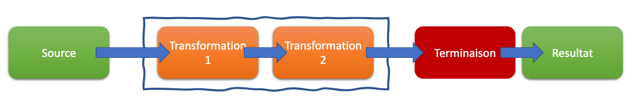

# Les streams & Les lambdas

-----

Depuis Java 8, la programmation fonctionnelle a fait son apparition au sein du langage Java.

La programmtion fonctionnelle a pour objetif d'appliquer des transformations (via l' 'utilisation des fonctions) sur des élements afin d'obtenir d'autres élements.

Les streams et les lambdas ont ainsi été intégrées dans le JDK pour mettre en place ce concept.

## Les lambdas

Depuis Java 8, les lambdas sont la fonctionnalité la plus important depuis Java5
* Evite de faire des classes anonymes
* Permet de réaliser de la programmation fonctionnelle
* Evite d’écrire du code inutile.

Syntaxe :
```
(parameter) -> //unique instruction

(parameter) -> {
 //instructions
}
```
Les instructions d'une lambda doivent être trés courtes. Le plus souvent, une seule ligne d'instruction constitue le corps de la lambda.

> Les accolades ne sont pas obligatoire. 
> Dans ce cas, une seule ligne d’instruction, ne se terminant pas par un point-virgule et dont le résultat de l’instruction est considéré comme la valeur de retour

```java
import java.time.LocalDate;
import java.time.LocalTime;
import java.util.Arrays;
import java.util.Comparator;
import java.util.List;
import java.util.StringJoiner;
import java.util.stream.Collectors;

public class Main1 {

    static class Personne{
        String nom;
        LocalDate dateNaissance;

        public Personne(String nom, LocalDate dateNaissance) {
            this.nom = nom;
            this.dateNaissance = dateNaissance;
        }

        @Override
        public String toString() {
            return nom + " - " + dateNaissance;
        }
        
        public LocalDate getDateNaissance() {
          return dateNaissance;
        }
  
        public String getNom() {
          return nom;
        }
    }

    public static void main(String[] args) {

        Personne donald = new Personne("donald", LocalDate.parse("1934-01-01"));
        Personne mickey = new Personne("mickey", LocalDate.parse("1928-01-01"));
        Personne dingo = new Personne("dingo", LocalDate.parse("1932-05-25"));
        List<Personne> personnages = Arrays.asList(donald, mickey, dingo);

        Comparator<Personne> compare = (p1, p2) -> p1.dateNaissance.compareTo(p2.dateNaissance);
        personnages.sort(compare);

        System.out.println(personnages);
    }
}

```

### Les méthodes d'inférence

Il est fréquent qu'une lambda n'est simplement que l'application d'une transformation, d'une comparaison sur une propriété.
Il est possible de passer uniquement que la fonction. Celle ci sera appliquées sur tous les élements. 

Pour ne passer qu'une méthode, on indique uniquement où elle se trouve en utilisant **::** au lieu du point.

```java
import java.time.LocalDate;
import java.util.Arrays;
import java.util.Comparator;
import java.util.List;

public class Main2 {
    public static void main(String[] args) {
        Main1.Personne donald = new Main1.Personne("donald", LocalDate.parse("1934-01-01"));
        Main1.Personne mickey = new Main1.Personne("mickey", LocalDate.parse("1928-01-01"));
        Main1.Personne dingo = new Main1.Personne("dingo", LocalDate.parse("1932-05-25"));
        List<Main1.Personne> personnages = Arrays.asList(donald, mickey, dingo);

        Comparator<Main1.Personne> compare = Comparator.comparing(Main1.Personne::getDateNaissance);

        personnages.sort(compare);

        System.out.println(personnages);
    }
}


```

> La méthode static **Comparator.comparing** prend en parématre un méthode dont le but est de fournir une valeur pour la comparer.

```java
    public static <T, U extends Comparable<? super U>> Comparator<T> comparing(
            Function<? super T, ? extends U> keyExtractor)
```

L'interface Function est une interface fonctionnelle prenant un élément en entrée et fournissant un valeur en retour.

Ainsi, nous passons la méthode **Main1.Personne::getDateNaissance**. 

A l'execution, la jvm va :
- invoquer la méthode getDateNaissance sur les élements de la liste afin de récupérer la date de naissance
- comparer des couples de date de naissance afin de classes les objets.

## Les streams

Une stream ;
* Permet de mieux interagir avec des collections de données
* Permet de chainer des transformations sur une collection
* S’appuie sur un nouveau concept : lambda
* Support la programmation fonctionnelle
    * Transformer des objets
    * Eviter les effets de bord

Un stream c’est 3 élements :
* Une source de données (la collection …)
* Des transformations
* Une opération terminale



```java
import java.util.ArrayList;

public class Main6 {
    public record Country(String name, String capital){};

    public static void main(String[] args) {
        var countries = new ArrayList<Main5.Country>();
        countries.add(new Main5.Country("France", "Paris"));
        countries.add(new Main5.Country("Allemagne", "Berlin"));
        countries.add(new Main5.Country("Anglaterre", "Londres"));
        countries.add(new Main5.Country("Belgique", "Bruxelles"));

        countries.stream()
                .forEach(country -> System.out.println(country.name().toUpperCase() + " a pour capitale " + country.capital()));
    }
}

```

```shell
mvn --quiet compile exec:java -Dexec.mainClass=Main6
FRANCE a pour capitale Paris
ALLEMAGNE a pour capitale Berlin
ANGLATERRE a pour capitale Londres
BELGIQUE a pour capitale Bruxelles
```

Une transformation applique la transformation sur chaque élement de la stream et retourne une autre stream

| Transformation                                    | Description                                           |
|---------------------------------------------------|-------------------------------------------------------|
| filter                                            | Permet de filtrer les données                         |
| map <br/>mapToInt <br/>mapToLong <br/>mapToDouble | Permet de réaliser une transformation de la données   |
| reduce                                            | Réaliser une réduction sur les éléments de la streams |
| distinct                                          | Supprime tous les éléments en double                  |
| skip                                              | Permet de sauter un certain nombre d’éléments         |
| limit                                             | Permet de réduire le nombre d’éléments de la Stream   |
| sorted                                            | Permet de trier les éléments                          |


Par exmple, reprenons l'exemple précédent, et créons la chaine de caractéres avant la sortie console

### La transformation  avec map

```java
import java.util.ArrayList;

public class Main7 {
    public record Country(String name, String capital){};

    public static void main(String[] args) {
        var countries = new ArrayList<Main5.Country>();
        countries.add(new Main5.Country("France", "Paris"));
        countries.add(new Main5.Country("Allemagne", "Berlin"));
        countries.add(new Main5.Country("Anglaterre", "Londres"));
        countries.add(new Main5.Country("Belgique", "Bruxelles"));

        countries.stream()
                .map(country -> country.name().toUpperCase() + " a pour capitale " + country.capital())
                .forEach(str -> System.out.println(str));
    }
}

```

### Le filtre

Le filtre introduit par **filter** permet d'extraire les élements dont le filtre retourne **true**.

```java
import java.util.ArrayList;

public class Main8 {
public record Country(String name, String capital){};

    public static void main(String[] args) {
        var countries = new ArrayList<Main5.Country>();
        countries.add(new Main5.Country("France", "Paris"));
        countries.add(new Main5.Country("Allemagne", "Berlin"));
        countries.add(new Main5.Country("Anglaterre", "Londres"));
        countries.add(new Main5.Country("Belgique", "Bruxelles"));

        countries.stream()
                .filter(country -> country.name().startsWith("A"))
                .map(country -> country.name().toUpperCase() + " a pour capitale " + country.capital())
                .forEach(str -> System.out.println(str));
    }
}
```

### Le tri

Le tri est réalisé par la méthode **sorted**. En ne passant de paramétres, les éléments seront triés si ils sont comparable.

Il est également possible de passer une instance de la classe Comparator afin de permettre de comparer les élements entre eux.

```java
import java.util.ArrayList;

public class Main9 {
    public record Country(String name, String capital){};

    public static void main(String[] args) {
        var countries = new ArrayList<Main5.Country>();
        countries.add(new Main5.Country("France", "Paris"));
        countries.add(new Main5.Country("Allemagne", "Berlin"));
        countries.add(new Main5.Country("Anglaterre", "Londres"));
        countries.add(new Main5.Country("Belgique", "Bruxelles"));

        countries.stream()
                .sorted((c1, c2) -> c1.name().compareToIgnoreCase(c2.name()))
                .map(country -> country.name().toUpperCase() + " a pour capitale " + country.capital())
                .forEach(str -> System.out.println(str));
    }
}

```

## Les terminaisons

Les terminaisons ne retournent pas de streams.

Le chainage d’altération est interrompu

| Methode   | Description                                                                                              |
|-----------|----------------------------------------------------------------------------------------------------------|
| findFirst | Retourne le 1er éléments de la stream                                                                    |                       
| allMatch  | Retourne true si tous les éléments de la stream valide le predicat                                       |   
| noneMatch | Retourne true si au moins un des éléments de la stream valide le predicat                                |
| anyMatch  | Retourne true si aucun éléments de la stream valide le predicat                                          |     
| count     | Retourne le nombre d’éléments de la stream                                                               |           
| max       | Retourne l’élément maximal de la stream (utilisation de comparateur)                                     |
| min       | Retourne l’élément minimal de la stream (utilisation de comparateur)                                     |
| toArray   | Convertit les élements de la stream en un tableau                                                        |
| collect   | Permet de collecter les élements de la stream et de les récupérer sous la format d’une liste, d’un set…  |


```java 
import java.util.ArrayList;

public class Main10 {
    public record Country(String name, String capital){};

    public static void main(String[] args) {
        var countries = new ArrayList<Main10.Country>();
        countries.add(new Main10.Country("France", "Paris"));
        countries.add(new Main10.Country("Allemagne", "Berlin"));
        countries.add(new Main10.Country("Anglaterre", "Londres"));
        countries.add(new Main10.Country("Belgique", "Bruxelles"));

        var firstItem = countries.stream()
                .sorted((c1, c2) -> c1.name().compareToIgnoreCase(c2.name()))
                .findFirst();

        if(firstItem.isPresent()){
            var country = firstItem.get();
            System.out.println("Pays : " + country.name + ", Capitale : " + country.capital());
        }
    }
}
```
