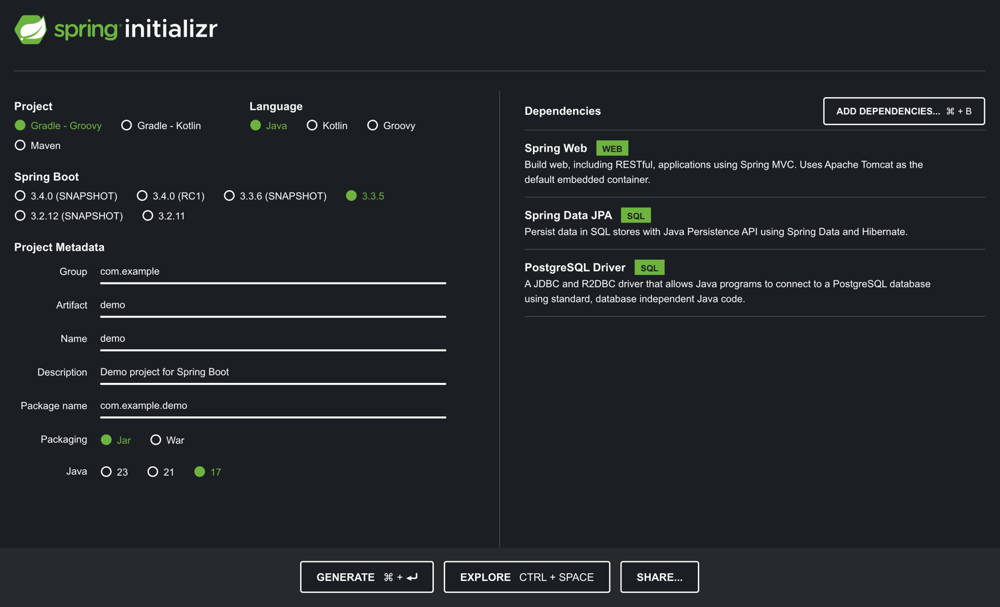
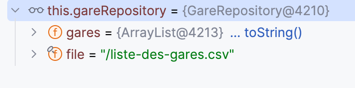
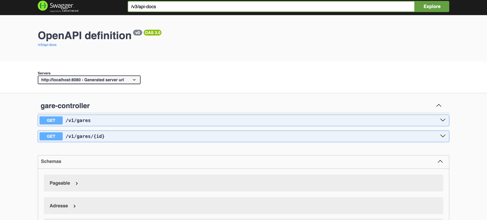

# Introduction

## Spring

Développé depuis plus de 10 ans, [Spring](https://spring.io/why-spring) est le framework le plus connu dans le développement d'applications d'entreprise du monde Java.

Historiquement, et ce qui est encore le coeur du framework, est l'implémentation du design pattern **Inversion Of Control** ou en francais, **Injection de dépendances**

Ce design pattern a pour but de déléguer l'instanciation des classes de services au framework Spring. 
Ainsi, ce n'est plus vous qui créez les instances des classes par le mot clé **new**. Votre rôle consistera à créer les classes de services, à indiquer les relations entre elles (association). Le framework Spring s'occupera de créer les instances et d'injecter automatiquement les instances nécessaires à vos objects.Tel un maitre d'orchestre, il donnera vie à votre programme.

A partir de ce principe, tout un ecosystéme est disponible et permet de couvrir quasiment tout le périmétre nécessaire au developpement.
Cet ecosysteme est matérialisé par un nombre important de librairies. 

Par exemple : 
- Spring MVC pour le developpement d'applications Web
- Spring Security pour la sécurisation
- Spring Data pour faciliter l'accés aux données
- Spring Batch pour le developpement Batch
- Spring Intégration pour gérer les patterns d'entreprises tel que l'Event Driven Architecture
- ...


## Spring Boot

Le developpement d'applications d'entreprise nécessitant le plus souvent l'utilisation combinée de plusieurs librairies **Spring**. 
Comment garantir que la version des librairies peuvent fonctionner correctement ? Comment permettre une configuration facile de celles-ci ?

[Spring Boot](https://spring.io/projects/spring-boot) a été conçu dés 2014 pour répondre à ces problématiques.

Il permet ainsi :
- de garantir une compatibilité entre les versions des librairies
- de fournir un mécanisme de configuration facilement la paramétrage
- de permettre le developpement d'applications dites **standalone**. L'application Java développée a ainsi tous les élements pour fonctionner de manière autonome.


## Spring Initializr

[Spring Initializr](https://start.spring.io/) est un service internet permettant de selectionner vos besoins et de générer automatiquement un projet Java prêt à développer.



> Spring Initializr est directement intégré dans la version Intellij Ultimate

<div style="page-break-before: always"> </div>

# Les Bases

Le but de Spring est d'instancier lui-meme les classes de services et d'associer celles-ci entre.

Pour detecter qu'une classe doit être géré par Spring, il est nécessaire de déclarer des annotations.

En partant d'un exemple, nous allons découvrir les annoations à utiliser.

> Les premieres versions de Spring, avant l'avénement des annotations, utilisaient des fichiers xml pour associer les instances entre elles.


## Les annotations @Service, @Component et @Repository

Positionnées au-dessus du nom de la classe, elle indique à Spring que la classe doit être instanciés et qu'elle sera utilisé au sein du contexte de l'application.

Fonctionnement quasiment identiques, la différence de noms est surtout présente pour indiquer le rôle que la classe va jouer.
- **@Component** : composant de base. Assure un fonctionnement globale à l'application
- **@Service** : composant indiquant que cette classe va intégrer des régles de gestion lié au périmétre couvert par l'application
- **@Repository** : composant dont l'objectif est de fournir des accés aux données.

La classe **GareRepository** a pour objectif de charger à partir d'un fichier CSV une liste de gares en France. 
Assoicée à de la restituion de données, cette classe est annotée avec l'annotation **@Repository**.
```java 
@Repository
public class GareRepository {

    private List<Gare> gares;

    private final String file;

    public GareRepository(@Value("${demo.file}") String file) {
        this.file = file;
    }

    @PostConstruct
    public void initialize() {
        try (var reader = new BufferedReader(new InputStreamReader(GareRepository.class.getResourceAsStream(this.file)))) {
            var csvReader = new CsvToBeanBuilder<Gare>(reader)
                    .withType(Gare.class)
                    .withSeparator(';')
                    .build();
            this.gares = csvReader.parse();
        } catch (IOException e) {
            throw new RuntimeException(e);
        }
    }

    public Optional<Gare> findGareByVille(String ville) {
        return gares.stream().filter(gare -> gare.getLibelle().startsWith(ville)).findFirst();
    }
}
```

En mettant l'application en debug, nous constatons qu'une instance à cette classe a été crée par Spring.



Quant à la classe **GareService**, elle représente la classe de service de l'application de gestion des gares.
Cette classe a besoin d'accés aux données associées aux gares. 
Ainsi, lors du chargement de spring, l'instance de la classe **GareService** aura besoin de la classe **GareRepository** pour être pleinement fonctionnel.
Nous déclarons ainsi un constructeur prenant en paramétre une instance de cette classe. 

```java
@Service
public class GareService {
    
    private static final Logger LOGGER = LoggerFactory.getLogger(GareService.class);

    private GareRepository gareRepository;

    public GareService(GareRepository gareRepository) {
        this.gareRepository = gareRepository;
    }

    public Optional<Gare> findGareByVille(String ville) {
        LOGGER.debug("Rercherche de la gare commencant par {}", ville);
        return this.gareRepository.findGareByVille(ville);
    }
}
```

Lorsque Spring crérera l'instance de la classe **GareService**, il réalisera les étapes suivantes : 

1. Chargement de la classe **GareService**
2. Detectection du contructeur necessitant en paramétre à la classe **GareRepository**
3. Création d'une instance à la classe **GareRepository**
4. Création d'une instance à la classe  **GareService** en invoquant le constructeur **GareRepository**

Si nous nous mettons en debug, nous constaterons que l'instance à **GareService** posséde bien une instance à la classe **GareRepository**.


## L'annotation @Autowired

L'annotation **@Autowired** indique à Spring que la propriété doit être renseignée (settée) avec une instance de classe gérée par Spring.

```java
@SpringBootApplication
public class Application implements CommandLineRunner {

    @Autowired
    GareService gareService;

    @Override
    public void run(String... args) throws Exception {
        System.out.println("Recherche d'une gare à lille : ");
        System.out.println(this.gareService.findGareByVille("Lille").orElseThrow().toString());
    }

    public static void main(String[] args) {
        SpringApplication.run(Application.class, args);
    }
}

```

Dans la classe **Application**, classe de lancement de notre application, l'instance de cette classe utilisera l'instance de la classe **GareService** pour invoquer la méthode **findGareByVille**.

Ainsi, en mettant l'annotation  @Autowired sur cette propriété, Spring injectera l'instance la classe de service.

```java
 @Autowired
 GareService gareService;
```

## Spring Boot et la configuration

Spring Boot fournit un mécanisme avancé de configuration d'applications à travers des fichiers de configuration, des paramétres d'environnement...

Chaque librairie associée à un domaine technique fournit par défait un ensemble de variables afin de faciliter son fonctionnement.

Par exemple, la configuration des logs est facilité par des variables spécifique :

Fichier [application.yml](src/main/resources/application.yml)

```yaml
logging:
    level:
      root: warn
      org.springframework.web: debug
      fr.epsi.spring: debug

```

Il également possible d'ajouter ses propres variables : 

```yaml
demo.file: /liste-des-gares.csv
```

Pour utiliser ces variables, l'annoation @Value indiquera à spring à injecter la valeur associée en allant chercher la valuer dans les élements de configuration.

```java
@Repository
public class GareRepository {

    private List<Gare> gares;

    private final String file;

    public GareRepository(@Value("${demo.file}") String file) {
        this.file = file;
    }
}
```

## l'annotation **@SpringBootApplication**

L'annotation **@SpringBootApplication** indique à Spring que la classe de chargement de l'application. 
On y trouve généralement la méthode **main** utiliséé pour lancer l'application.

```java
@SpringBootApplication
public class Application implements CommandLineRunner {

    @Autowired
    GareService gareService;

    @Override
    public void run(String... args) throws Exception {
        System.out.println("Recherche d'une gare à lille : ");
        System.out.println(this.gareService.findGareByVille("Lille").orElseThrow().toString());
    }

    public static void main(String[] args) {
        SpringApplication.run(Application.class, args);
    }
}
```

Il est impossible de positioner du code dans la méthode main pour utiliser les services que nous venons de créer. 
Dans notre exemple, la classe implémente l'interface **CommandLineRunner**. 

Cette interface propose la méthode *run* à implémenter. Aprés le chargement de **Spring**, la méthode sera invoquée par l'application en passant en paramétre les arguments passés lors du changement de l'application (ie les mêmes que ceux de la méthode main) 
 
Ainsi, l'execution de cette classe lancera le programme :

```shell
mvn --quiet compile exec:java -Dexec.mainClass=fr.epsi.spring.base.Application
 /\\ / ___'_ __ _ _(_)_ __  __ _ \ \ \ \
( ( )\___ | '_ | '_| | '_ \/ _` | \ \ \ \
 \\/  ___)| |_)| | | | | || (_| |  ) ) ) )
  '  |____| .__|_| |_|_| |_\__, | / / / /
 =========|_|==============|___/=/_/_/_/

 :: Spring Boot ::                (v3.3.0)

2024-11-06T23:33:13.427+01:00  INFO 6471 --- [           main] fr.epsi.spring.base.Application          : Starting Application using Java 21.0.2 with PID 6471 (/Users/nrousseau1/Documents/03.sources/epsi/java-introduction/20-Spring/22-Base/target/classes started by nrousseau1 in /Users/nrousseau1/Documents/03.sources/epsi/java-introduction)
2024-11-06T23:33:13.430+01:00 DEBUG 6471 --- [           main] fr.epsi.spring.base.Application          : Running with Spring Boot v3.3.0, Spring v6.1.8
2024-11-06T23:33:13.430+01:00  INFO 6471 --- [           main] fr.epsi.spring.base.Application          : No active profile set, falling back to 1 default profile: "default"
2024-11-06T23:33:14.125+01:00  INFO 6471 --- [           main] fr.epsi.spring.base.Application          : Started Application in 1.045 seconds (process running for 1.373)
Recherche d'une gare à lille : 
2024-11-06T23:33:14.127+01:00 DEBUG 6471 --- [           main] f.epsi.spring.base.service.GareService   : Rercherche de la gare commencant par Lille
Gare[adresse=fr.epsi.spring.base.domain.Adresse@3a2b2322, id=0, libelle='Lille-St-Sauveur', supportFret=true, supportVoyageurs=false, codeLigne='277100']
```

<div style="page-break-before: always"> </div>

# Spring MVC

## Dépendance

Afin d'utiliser Spring MVC, il est nécessaire d'ajouter la dépendance suivante dans le fichier **pom.xml**.

```xml
<dependency>
     <groupId>org.springframework.boot</groupId>
    <artifactId>spring-boot-starter-web</artifactId>
    <version>${spring.boot.version}</version>
</dependency>
```

## Les contrôleurs

Les classes interceptant les appels à http sont souvent appelées des *contrôleurs*.

Les annotations **@RestController** ou **Controller** sont à positionner sur les classes ayant ce rôle.

```java
@RestController
public class GareController {

}
```

Ces classes interceptant des appels http doivent être associes à des urls. 
L'annotation **@RequestMapping** permet de définir l'url associée et également le contenu produit et/ou intercepté.

L'exemple précédent est complété afin d'indiquer que la classe *GareController* interceptera les urls de type **/v1/gares** et produira du contenu json.

```java
@RestController
@RequestMapping(value = "/v1/gares", produces = MediaType.APPLICATION_JSON_VALUE)
public class GareController {

}
```

## Les méthodes

Les méthodes des classes controleurs vont être associées à des appels http. 
Pour chaque type de méthodes http, une annotation spécifique y sera associée.

| Annotation     | Méthode Http | Rôle                                                        |
|----------------|--------------|-------------------------------------------------------------|
| @GetMapping    | GET          | Récupérer un element ou une liste d'éléments                |
| @PostMapping   | POST         | Créer / modifier un élement                                 |
| @PutMapping    | PUT          | Modifier une partie d'un élement                            |
| @DeleteMapping | DELETE       | Supprimer un élement                                        |      
| @HeadMapping   | HEAD         | Verifier si un élement existe. Aucun contenu n'est retourné |


La méthode **search** permet de récupérer un énsemble de gares.

```java
@GetMapping
Page<Gare> search(Pageable page) {
    return gareService.findAll(page);
}
 ```

La méthode **searchById** permet de rechercher une gare à partir de son identifiant. 
L'url sera de la forme "/{id}", l'id représentant l'identifiant de la gare. 
Spring va automatiquement extraire l"identifiant de l'url. 
Par exemple, à partir de l'url http://localhost:8080/v1/gares/87741132, Spring va extraire la valeur **87741132** et l'associer à la variable interceptant la variable du chemin id.

```java
@GetMapping("/{id}")
Gare searchById(@PathVariable("id") Long id) {
    return gareService.findById(id).orElse(null);
}
```

Des annotations sont prévues pour chaque type de variables : 

| Annotation      | Type de variable          | exemple          | 
|-----------------|---------------------------|------------------|
| @PathVariable   | variable dans l'url       | /v1/gares/12446  |
| @RequestParam   | paramétres de la requete  | /v1/gares?page=2 |
| @RequestBody    | corps de l'appel          |                  |
| @RequestHeader  | Paramétre dans l'entête   |                  |

L'annotation doit être positionnée avant le paramétre de la méthode en indiquant si nécessaire le nom de la valeur extrait de l'appel.


> Par defaut l'application s'execute sur le port 8080. La variable **server.port** permet de changer le port.
> Cette variable peut être modifiée dans le fichier application.yml ou passée en parametre

## Jouer avec les codes HTTP

Réaliser des API Rest suppose de respecter 2 régles :
- utilsier correctement les méthodes HTTTP
- s'appuyer sur les codes HTTP pour donner un sens à la résponse.

Par exemple, si un élement n'existe pas, le service retournera le code http 404

Lors de la création d'un élement, le service retournera le code http 401 (CREATED) avec l'url afin de récuperer la resource.

Si une erreur de données, l'application retournera un code du type 4XX.

Pour une erreur serveur non gérée, on sera le plus fréquemment sur une erreur du type 500.

Pour personnaliser les codes retournés, nous avons à notre possession:
- l'utilisation de la classe **ResponseEntity**
- l'utilisation de l'annotation **@ResponseStatus** lors de la déclaration des exceptions.


### La classe **ResponseEntity**

Au lieu de retourner directement l'objet en retour de la méthode interceptant une url, il est possible de retourner une instance de la classe **ResponseEntity** et en personnalisant :
* le code http
* le contenu retourné
* la personnalisation des entêtes http

Par exemple, le code suivant indique une manière pour la création d'une nouvelle resource.

```java
@PostMapping
ResponseEntity<Void> create(@RequestBody Gare gare) {
    this.gareService.save(gare);
    var createdObjectRequest = UriComponentsBuilder.fromPath("/v1/gares/{id}")
            .build(gare.getId());
    return ResponseEntity.created(createdObjectRequest).build();
}
```

Si nous créons la nouvelle gare, 

```shell
curl -X 'POST' \
  'http://localhost:8080/v1/gares' \
  -H 'accept: */*' \
  -H 'Content-Type: application/json' \
  -d '{
  "libelle": "Nouvelle Gare",
  "supportFret": true,
  "supportVoyageurs": true,
  "codeLigne": "TER1",
  "adresse": {
    "commune": "EPSI City",
    "departement": "Nord"
  }
}' -v
```

nous obtenons en réponse : 
```shell
< HTTP/1.1 201 
< Location: /v1/gares/87988720
< Content-Length: 0
< Date: Tue, 12 Nov 2024 21:26:50 GMT
```

###  L'annotation **@ResponseStatus**

L'annotation **@ResponseStatus** positionnée sur la classe d'une exception permet de définir le code http et le message en cas de la levée de l'exception.

Créons une nouvelle classe d'exception **NotFoundException** qui sera utilisée lorsqu'une gare ne sera pas trouvée.

```java
@ResponseStatus(HttpStatus.NOT_FOUND)
public class NotFoundException  extends Exception{
}
```

En modifiant la méthode **findById**, nous indiquons que la méthode peut lever l'exception : 

```java
@Operation(description = "Permet de rechercher une gare à partir de son id")
@ApiResponses({
        @ApiResponse(responseCode = "200",
                content = {@Content(mediaType = "application/json",
                        schema = @Schema(implementation = Gare.class))}),
        @ApiResponse(responseCode = "404", description = "gare non trouvée", content = @Content())
})
@GetMapping("/{id}")
Gare searchById(@PathVariable("id") Long id) throws NotFoundException{
    return gareService.findById(id).orElseThrow(()-> new NotFoundException());
}
```

En testant avec un identiant de gara inconnu, nous obtenons l'erreur 404.
```shell
curl -X 'GET' \
  'http://localhost:8080/v1/gares/9999999' \
  -H 'accept: application/json' \
  -v
```

```shell
< HTTP/1.1 404 
< Content-Type: application/json
< Transfer-Encoding: chunked
< Date: Tue, 12 Nov 2024 21:44:40 GMT
< 
* Connection #0 to host localhost left intact
{"timestamp":"2024-11-12T21:44:40.988+00:00","status":404,"error":"Not Found","path":"/v1/gares/9999999"}% 
```

> Afin de réaliser un swagger contenant le plus d'informations sur les services, il est parfois nécessaire d'enrichir la description avec des annotations. Par exemple, l'annotation @ApiResponses permet de décrire les codes http pouvant être retournés.

> L'annotation @ResponseStatus permet dégérer des cas simples de retour http.
> Il est également possible d'utiliser les annotations @ExceptionHandler et @ControllerAdvice qui permettrons de personnaliser plus finement le code http et le contenu retournés.

## swagger-ui

Les applications Java sont essentiellement utilisées pour créer des API Rest.
Pour définir les contrats de services, c'est à dire les urls prises en charge par l'application, des documents swagger sont le plus souvent proposés.. 
Ces documents sont au format Json. 

Il est assez facile d'intégrer des librairies permettant :
- de générer le document Json
- de fournir un visuel type swagger-ui

Pour spring boot 3, ajouter la dépendance : 

```xml
 <dependency>
    <groupId>org.springdoc</groupId>
    <artifactId>springdoc-openapi-starter-webmvc-ui</artifactId>
    <version>2.5.0</version>
</dependency>
```

Au lancement de l'application, de nouveaux endpoints seront disponibles : 

L'url http://localhost:8080/v3/api-docs permet de visualer le document JSON de définitions des services : 

```json
{
  "openapi": "3.0.1",
  "info": {
    "title": "OpenAPI definition",
    "version": "v0"
  },
  "servers": [
    {
      "url": "http://localhost:8080",
      "description": "Generated server url"
    }
  ],
  "paths": {
    "/v1/gares": {
      "get": {
        "tags": [
          "gare-controller"
        ],
        "description": "Permet de rechercher des gares",
        "...": "..."
      }
    }
  }
}
```

L'url http://localhost:8080/swagger-ui/index.html permet de visualiser une page type swagger-ui



## Créer une application web autonome

Un des objectifs de spring boot est fournir une application au format jar totalement autonome ayant tout le nécessaire pour s'executer.

En executant la commande suivante, un fichier au format jar contenant tout le nécessaire au fonctionnement sera réalisé à la racine du répertoire **target** 
```shell
mvn clean package spring-boot:repackage
```

La commande java permettra de lancer l'application : 

```shell
java -jar target/23-SpringMVC-1.0-SNAPSHOT.jar fr.epsi.spring.demo.Application
```


<div style="page-break-before: always"> </div>

