# Introduction

-----

## Helloworld

Pour démarrer l'apprentissage d'un programme, rien de tel que l'écriture du fameux HelloWorld.

Fichier **[Helloworld.java](src/main/java/Helloworld.java)**

```java
public class Helloworld {

    /**
     * point d'entrée des programmes java. Il est nécessa&ire de respecter exactement la signature
     * de cette méthode afin que le programme puisse s'exécuter.
     *
     * @param args tableau d'arguments passés lors du lancement du programme
     */
    public static void main(String[] args) {
        System.out.println("Hello world !");
    }
}
```

Pour compiler le programme, il est nécessaire de se positionner dans le repertoire **src**

```shell
cd src/main/java
javac Helloworld.java
java Helloworld
```

> En java, toute ligne d'instructions est terminée par un **point virgule**

> Depuis Java 23, il est possible de créer une méthode *main* sans être dans une classe [JEP 477](https://openjdk.org/jeps/477)

### Déclaration d'une variable

Pour utiliser une variable, il est nécéssaire de la déclarer et de lui assigner une valeur. 
Lors de la déclaration, on definit le type de la variable (primitif, classe, record, enum) suivi du nom de la variable.

Fichier **[Variables1.java](src/main/java/Variables1.java)**

```java
public class Variables1 {

    public static void main(String[] args) {
        /**
         * Declaration  et assignement d'une variable
         */
        int magicNumber = 62;

        /**
         * Une chaine de caractères peut être concaténée à tout type d'élements
         */
        System.out.println("Le nombre magique est " + magicNumber);

        /*
         * L'utilisation de la méthode printf permet d'écrire des chaines de caractères
         * en formattant la chaine de chaine de caratères.
         */
        System.out.printf("Le nombre magique est %d", magicNumber);

        // des variable
        short year = 2024;
        char a = 'a';

        double montant = 3_000;

        long longNumber = 5_678_232;
        long longNumber2 = 5_678_232l;

        LocalDateTime now = LocalDateTime.now();

        boolean yes = true;
    }
}
```

```shell
mvn --quiet compile exec:java -Dexec.mainClass=Variables1
Le nombre magique est 62
Le nombre magique est 62
````

Il est tout à fait possible de déclarer puis, par la suite, d'assigner une valeur à cette variable.

Fichier **[Variables2.java](src/main/java/Variables2.java)**


```java
public class Variables2 {

    public static void main(String[] args) {
        /**
         * Declaration puis assignement
         */
        String name;
        name = "Java";
        System.out.printf("Un langage toujours au top : %s", name);
    }
}
```

```shell
mvn --quiet compile exec:java -Dexec.mainClass=Variables2
Un langage toujours au top : Java
````

> tant qu'une variable, déclarée dans le corps d'une méthode, n'est pas assignée à une valeur, elle ne peut pas être utilisée.

Fichier **[Variables3.java](src/main/java/Variables3.java)**

```java
public class Variables3 {

    public static void main(String[] args) {
        /**
         * Declaration sans assignement
         */
        int ageDuCapitaine;
        System.out.printf("L'age du capitaine est %d", ageDuCapitaine);
    }
}
```

```sh
javac Variables3.java
Variables3.java:8: error: variable ageDuCapitaine might not have been initialized
        System.out.printf("L'age du capitaine est %d", ageDuCapitaine);
```
### Les primitives

Java n'est pas un lanqage purement objet. 8 primitives sont mises à disposition au développeur.

| Catégorie | Type      | Taille         | Signé    | Min                | Max                                  
|-----------|-----------|----------------|----------|--------------------|--------------------------------------
|           | byte      | 2<sup>8</sup>  | signed   | -128               | 127                                  
|           | char      | 2<sup>16</sup> | unsigned | 0                  | 2<sup>16</sup>-1                     
| Entier    | short     | 2<sup>16</sup> | signed   | -2<sup>15</sup>    | 2<sup>15</sup>-1                     
|           | int       | 2<sup>32</sup> | signed   | 2<sup>2</sup>      | 2<sup>31</sup>-1                     
|           | long      | 2<sup>64</sup> | signed   | -2<sup>63</sup>    | 2<sup>63</sup>-1                     
| Decimaux  | float     | 2<sup>32</sup> | signed   | -2<sup>-149</sup>  | (2-2<sup>-23</sup>) * 2<sup>127</sup> 
|           | double    | 2<sup>64</sup> | signed   | -2<sup>-1074</sup> | (2-2<sup>-52</sup>) * 2<sup>21023</sup> 
| Autre     | boolean   |                |          |                    |

Les opérateurs d'assignement permettent de modifier la valeur d'une primitive.

| Operateur | Nom                                    | Exemple                       |
|-----------|----------------------------------------|-------------------------------|
| =         | Assigne une valeur                     | int i = 18;                   |    
| +=        | Ajoute la valeur de droite             | i = 1;i += 56 // i vaut 57    |
| -=        |  Soustrait la valeur de droite         |i = 10;i -= 2 // i vaut 8
| /=        | Division par la valeur de droite       | i = 10;i /= 2 // i vaut 5     |
| *=        | Multiplication par la valeur de droite | i = 10;i *= 2 // i vaut 20    |
| %=        | Application du modulo                  | i = 10;i %= 2 // i vaut 0     |

Les opérateurs mathématiques sont utilisés sur les primivites pour réaliser des opérations.

| Operateur | Nom                                         | Exemple |
|-----------|---------------------------------------------|---------|
| +         | Addition                                    | 1 + 5   |
| -         | Soustraction                                | 1 – 3   |
| *         | Multiplication                              | 45 * 90 |
| /         | Division                                    | 1 / 10  |
| %         | Modulo (Reste de la division Euclidienne)   | 65 % 3  |
| ++        | Incrémente de 1                             | i++     |
| --        | Décrémente de 1                             | i--     |


Il est possible de convertir un paramétre d'un certain type (de primitif) en un autre. 
> Attention, il peut y avoir des pertes de precision lorsqu'on utilise un type dont l'intervalle de definition est plus petit.

```java
public class Variable5 {

    public static void main(String[] args) {
        //Explicit
        int value = 56;
        short castValue = (short) value;
        System.out.println(castValue);

        //Implicit
        short valueS = 56;
        int valueI = valueS;
        System.out.println(valueI);

        //Perte de precision
        int number = (int) 34.78; // numb
        System.out.println(number);
    }
}
```

```java
mvn --quiet compile exec:java -Dexec.mainClass=Variable5
56 
56
34
```

### Combinaison de type

| Calcul      | Resultat    | Régle                           |
|-------------|-------------|---------------------------------|
| 2/3         | 0           | ( int, int) -> (int)            |  
| 2/3.0       | 0,666666666 | ( int, double) -> (double)      | 
| 2.0/3.0     | 0,666666666 | ( double, double) -> (double)   |
| 2.0 + "3.0" | 2.03.0      | ( double, string) -> (string)   |

Régle : 

<center><b>String > double > int > char > boolean </b></center>


### Et si on parlait de *null*

Une variable peut : 
- ne pas être définie. 
- être associée à une valeur numerique, booleen, chaine de caractères, enumération, objet.
- être associée à **null**

**null** représente l'absence de valeur. il n'est ni un objet, ni un type. Il répresente une valeur spéciale.
Une variable associée à **null** mal utilisée peut entrainer l'exception **NullPointerException**.

**null** ne peut pas être assigné à une primitive

### Le mot clé *var*
Depuis Java5, il est possible d'éviter de déclarer le type d'une variable grâce au mot clé **var**.

Dans ce cas, il est nécessaire d'assigner une valeur afin que le compilateur infère le type de la variable.
Une fois le type inféré, il n'est plus possible d'assigner à la variable à une valeur d'un autre type.

Fichier **Variable4.java**

```java
public class Variables4 {

    public static void main(String[] args) {
        var birthday = 1995;
        var author = "James Gosling";

        System.out.printf("birthday :  %s, author : %s\n",   ((Object)birthday).getClass().getName(), author.getClass().getName());

        var message = "Java est apparu en " + birthday + " et un des auteurs est "+ author;
        System.out.println(message);
    }
}

```

```shell
mvn --quiet compile exec:java -Dexec.mainClass=Variables4
birthday :  java.lang.Integer, author : java.lang.String
Java est apparu en 1995 et un des auteurs est James Gosling
```

## Loop et conditions

### Avant : les opérateurs logiques ###

| Operateur            | Nom  | Exemple                    |
|----------------------|------|----------------------------|
| &&                   | Et   | x == y && x < z            |
| &#124;&#124;         | Ou   | x == y &#124;&#124; x < z  |
| !                    | Not  | !(x == y && x < z  )       |   


### if / else if / else

Le mot clé **if** permet d'éxécuter un bloc d'instructions si la condition est vraie.

Pour comparer des primitives, on peut utiliser un des comparateurs suivants : 

| Comparateur | Description         |
|-------------|---------------------|
| ==          | Egalité             |
| !=          | Différent           |
| <           | Plus petit          |
| <=          | Plus petit          |
| &gt;        | Plus grand          |
| &gt;=       | Plus grand  ou égal |

> Pour definir un bloc, on utilise les accolades { }

Fichier **[Condition1.java](src/main/java/Condition1.java)**

```java
public class Condition1 {

    public static void main(String[] args) {
        int age1 = 25;
        int age2 = 43;

        if(age1 < age2){
            System.out.printf("La variable age1 (%d) est à une valeur inférieure à la variable age2  (%d) ", age1, age2);
        }
    }
}
```

```shell
mvn --quiet compile exec:java -Dexec.mainClass=Condition1
La variable age1 (25) est à une valeur inférieure à la variable age2 
```


Le mot clé **else** permet d'exécuter le second bloc d'instructions dans le cas où la condition du **if** n'est pas réalisée.

Fichier **[Condition2.java](src/main/java/Condition2.java)**

```java
public class Condition2 {

    public static void main(String[] args) {
        int nombre = 19;
        if(nombre % 2 == 0){
            System.out.printf("Le nombre (%d) est un nombre pair ", nombre);
        }else{
            System.out.printf("Le nombre (%d) est un nombre impair ", nombre);
        }
    }
}

```

```shell
mvn --quiet compile exec:java -Dexec.mainClass=Condition2
Le nombre (19) est un nombre impair 
```

En utilisant **else if**, il est possible d'enchaîner des tests conditionnels en associant un bloc d'instructions à chaque test. 
Dés qu'un test est vrai, le bloc d'instructions est executé. Les conditions suivantes seront ignorées.

Fichier **[Condition3.java](src/main/java/Condition3.java)**

```java

public class Condition3 {

    public static void main(String[] args) {
        int angle = 85;
        if(angle == 90) {
            System.out.println("Angle droit");
        }else if(angle == 0) {
            System.out.println("Angle plat");
        }else if(angle > 90) {
            System.out.println("Angle obtus");
        }else {
            System.out.println("Angle aigu");
        }
    }
}
```

```shell
mvn --quiet compile exec:java -Dexec.mainClass=Condition3
Angle aigu
```

> dans le cas d'une succession de **else if**, le mot clé seul **else** sera toujours à la fin de cette succession.

### switch ... case
Dans sa forme de base, le switch case ressemble au **if**. Il permet de tester plusieurs alternatives.

```java
switch(variable) {
    case constante1:
    // bloc d'instructions
    case constante2:
    // bloc d'instructions
    //...
    default:
    // bloc d'instructions
}
```

> Attention : dés qu'un case est vraie, le bloc d'instructions est évalué. Si ce bloc ne se termine paa par le mot clé **break**, les *cases* situés en dessous seront évalués jusqu'au prochain **break** ou jusqu'à la fin du *swicth*.

> on ne peut pas avoir 2 cases avec la même constante

Depuis Java 12, le switch évolue afin d'intégrer le pattern matching.

### for

Le mot clé **for** permet d'executer plusieurs fois un même bloc d'instructions. 

Fichier **[Looping1.java](src/main/java/Looping1.java)**

```java
public class Looping1 {

    public static void main(String[] args) {
        for(int index=0; index<5; index++){
            System.out.printf("Hello %d ! \n", index);
        }
    }
}

```
Le bloc de code contenant l'instruction `System.out.printf("Hello %d ! \n", index);` est executé 5 fois (index pouvant varié de 0 à 4)

```shell
mvn --quiet compile exec:java -Dexec.mainClass=Looping1
Hello 0 ! 
Hello 1 ! 
Hello 2 ! 
Hello 3 ! 
Hello 4 ! 
```

Si on decompose les parties de **for**

| statement    | description                                                                                                                                                                                                                        |
|--------------|------------------------------------------------------------------------------------------------------------------------------------------------------------------------------------------------------------------------------------|
| int index= 0 | bloc de déclaration. La variable **index** est déclarée et sa valeur est initialisée à **0**                                                                                                                                       |
| index<5      | bloc d'évaluation. A chaque itération, la condition est évaluée et tant qu'elle est vraie, le bloc d'instructions sera évalué                                                                                                      |
| index++      | bloc d'instruction. A chaque itération, les instructions dans cette partie sont évaluées. C'est ici que l'on trouve le plus souvent une incrementation. Ici, à chaque passage la valeur de la variable **index** s'incrémente de 1 |


> on utilise la boucle **for** lorsque l'on peut déterminer à l'avance le nombre d'itérations. 

### L'operateur ternaire ?

Il est possible d'évaluer sur une meme ligne et d'assigner une valeur spécifique en fonction de la réalisation d'une condition.
On utilise l'operateur ternaire **?**

Voici un exemple long avec le mot clé **if**

Fichier **[Looping2.java](src/main/java/Looping2.java)**

```java
public class Looping2 {

    public static void main(String[] args) {
        for(int nombre=0; nombre<5; nombre++){
            if(nombre % 2 == 0){
                System.out.printf("Le nombre %d est un nombre pair.\n", nombre);
            }else{
                System.out.printf("Le nombre %d est un nombre impair.\n", nombre);
            }
        }
    }
}

```

```shell
mvn --quiet compile exec:java -Dexec.mainClass=Looping2
Le nombre 0 est un nombre pair.
Le nombre 1 est un nombre impair.
Le nombre 2 est un nombre pair.
Le nombre 3 est un nombre impair.
Le nombre 4 est un nombre pair.
```

il est possible d'utiliser l'operateur ternaire à la place du mot clé **if**

Fichier **[Looping3.java](src/main/java/Looping3.java)**

```java
public class Looping3 {

    public static void main(String[] args) {
        for(int nombre=0; nombre<5; nombre++){
            var type = nombre % 2 == 0 ? "pair": "impair";
            System.out.printf("Le nombre %d est un nombre %s.\n", nombre, type);
        }
    }
}

```

```shell
mvn --quiet compile exec:java -Dexec.mainClass=Looping3
Le nombre 0 est un nombre pair.
Le nombre 1 est un nombre impair.
Le nombre 2 est un nombre pair.
Le nombre 3 est un nombre impair.
Le nombre 4 est un nombre pair.
```

### While

Le mot clé **while** permet d'itérer tant que la condition associée au **while** est vérifiée.
while est souvent utilisé lorsque le nombre d'itérations ne peut être déterminé.

Fichier **[Looping4.java](src/main/java/Looping4.java)**

```java
public class Looping4 {

    public static void main(String[] args) {
        var total = 0;
        var inc = new SecureRandom().nextInt(10);
        while(total<20){
            total += inc;
        }
        System.out.printf("Inc : %d, Total : %d", inc, total);
    }
}
```

```shell
mvn --quiet compile exec:java -Dexec.mainClass=Looping4
Inc : 6, Total : 24
```

> il éxiste également l'instruction **do ...while()**. Le bloc d'instructions sera toujours évalué **au moins une fois**


## Les méthodes

Une méthode est une fonction réalisation un traitement spécifique. 

Une méthode : 
- porte un nom
- prend 0 à n arguments
- peut retourner une valeur.
- posséde des accolades. Les accolades vont introuduire le bloc d'instructions qui sera évalué lors de l'appel de la méthode.
- est déclarée à l'intérieur d'une classe.

Il existe 2 types de méthodes : 
- **les méthodes de classe** Ces méthodes, en fonction de leur portée, peuvent être appelé n'importe où dans le code en utilisant directement la classe.
- **les méthodes d'instance**. Ces méthodes manipules les propriétés d'un objet et altére le comportement de ce dernier. Ces méthodes ne peuvent pas être appelée à partir du nom de la classe.

> Depuis **Java 23**, il est possible de créer la méthode **main** en dehors d'une classe. [JEP - 477](https://openjdk.org/jeps/477)

Squelette d'une méthode : 

```
<scope> (static) <return type> methodName(<parameters>…) {
 ....
}
```

### Les méthodes de classe

Le mot clé **static** permet de definir une mathode de classe.

Une méthode peut ne rien retourner. Dans ce cas, on utilisera le mot clé **void**

Fichier **[Methode1.java](src/main/java/Methode1.java)**

```java

public class Methode1 {

    public static void displayHello(String name){
        System.out.println("Hello " + name  + " !");;
    }

    public static void main(String[] args) {
        displayHello("Bob");
    }
}

```

```shell
mvn --quiet compile exec:java -Dexec.mainClass=Methode1
Hello Bob !
```

Elle peut également retourner une donnée. Danc il faut indiquer dans la signature le type (primitif ou classe) que va retourner la méthode

Fichier **[Methode2.java](src/main/java/Methode2.java)**

```java
public class Methode2 {

    public static int sum(int a, int b){
        return a + b;
    }

    public static void main(String[] args) {
        System.out.printf("Somme 10 + 7 : %d", sum(10, 17));
    }
}
```

```shell
mvn --quiet compile exec:java -Dexec.mainClass=Methode2
Somme 10 + 7 : 27
```

Depuis Java5, il est possible de déclarer un nombre infini de paramétres d'un même type. On parle alors de **varargs**
Un seul vararg est autorisé par méthode et il doit être le dernier paramétre. 

Pour introduire un paramétre **vararg**, il suffit d'ajouter ***...*** apr&s le type du paramatré suivi du nom de celui ci.
Le paramétre sera considéré comme un tableau.

Fichier **[Methode3.java](src/main/java/Methode3.java)**

```java
public class Methode3 {

    public static int substract(int... numbers){
        int ret = 0;
        for(var number: numbers){
            ret -= number;
        }
        return ret;
    }

    public static void main(String[] args) {
        System.out.printf("Soustraction : %d\n", substract(1,3,4,5));
        System.out.printf("Soustraction : %d", substract(9, 8));
    }
}

```

```shell
mvn --quiet compile exec:java -Dexec.mainClass=Methode3
Soustraction : -13
Soustraction : -17
```

> Les exemples ci-dessus utilisent la notion de vararg. En effet, la méthode **System.out.printf** est uné méthode avec un vararg.
> Le premier paramétre est la chaine de caractéres, suivi de plusieurs paramétres qui seront utilisés pour remplacer les élements introduits par **%**.


## La classe System

La classe *System* fournit des méthodes pour interagier avec les entrées/sorties standards, récuperer les variables/propriétés d'environnements et quelques méthodes utilitaires.
La classe ne peut être instanciée.

### Sortie console : System.out

La propriété *System.out* permet de réaliser des sorties console. La propriété est de type **PrintStream** possédant des nombreux méthodes pour écrire dans le terminal.


| Méthode                        | Description                                                                                                |
|--------------------------------|------------------------------------------------------------------------------------------------------------|
| println(<pripmitive ou class>) | réalise une sortie console du paramétre en ajoutant un retour à la ligne                                   |
| print(<pripmitive ou class>)   | réalise une sortie console du paramétre                                                                    |
| printf(str, ...args)           | réalise une sortie en console en utlisant une chaine formattée. Les arguments seront intégrés à la chaâine |

> la propriété *System.err*  ressemble à la propriété  *System.out* mais réalise la sortie d'erreurs

### Entrée standard : System.in

La propriété *System.in* permet de lire les éléments saisies en console. La propriété est de type **InputStream**.

La classe **InputStream** founit des méthodes de base pour lire des octets. 
Pour faciliter la récupération des élements saisis, nous utilisons la classe *[java.util.Scanner]([https://docs.oracle.com/en/java/javase/21/docs/api/java.base/java/util/Scanner.html)*

```java
import java.util.Scanner;

public class Main1 {

    public static void main(String[] args) {
        Scanner scanner = new Scanner(System.in);

        System.out.print("Saisissez un mot : ");
        var mot = scanner.next();
        System.out.println("Résultat : " + mot);

        System.out.print("Saisissez un nombre : ");
        var nb = scanner.nextInt();
        System.out.println("Résultat  : " + nb);

        //pour forcer le scanner à lire jusqu'au retour charriot
        scanner.useDelimiter(System.getProperty("line.separator"));
        System.out.print("Saisissez une phrase : ");
        var phrase = scanner.next();
        System.out.println("Résultat : " + phrase);
    }
}

```

```shell
mvn --quiet compile exec:java -Dexec.mainClass=Main1
Saisissez un mot : java
Résultat : java
Saisissez un nombre : 8
Résultat  : 8
Saisissez une phrase : Java dans le top 3 des langages !
Résultat : Java dans le top 3 des langages !
```

<div style="page-break-before: always"> </div>

# Les tableaux

-----

Un tableau est une structure de données permettant de stocker une liste d’une longueur finie d’éléments de même type.

Un tableau est un objet possédant la propriété **length**. Cette propriété length permet d’obtenir la taille
du tableau

Les éléments d’un tableau sont accessibles à partir d’un index. 
Le premier élément est à l’index 0 (Zero based index origin)

## Déclaration

La déclaration est identique à celle utilisé dans le langage **C**.

**Syntaxe :**

```java 
type[] name; // syntaxe préconisée `
type name[]; 
```

- type : type des éléments stockés dans le tableau
- Bracket [] symbole indiquant que les éléments vont être stockés dans un tableau

Fichier **[Exemple1.java](src/main/java/Exemple1.java)**

```java
public class Exemple1 {
    public static void main(String[] args) {
        // Tableau d'entiers
        int[] arrayOfInt;
        // Tableau de float
        float distances[];
        // Tableau de double
        double[] values;
        // tableau de chaines de caractéres
        String[] name;
    }
}
```

## Instanciation
Pour instancier un tableau, il est nécessaire d'utiliser le mot clé **new** suivi du type et entre crochets, il faut préciser la taille du tableau.


Fichier **[Exemple2.java](src/main/java/Exemple2.java)**

```java
public class Exemple2 {

    public static void main(String[] args) {
        // Tableau d'entiers
        int[] arrayOfInt = new int[10];
        // Tableau de float
        float distances[] = new float[5];
        // Initialisation directe avec valeur
        double[] values = {1.0, 2, 3.0};
        // tableau de chaines de caractéres
        String[] name;
        name = new String[5];
    }
}
```

Lors de l'initiation, chaque cellule du tableau sera initialisé par la valeur par défaut associée au type.
- numerique (primitive) = 0
- boolean = false
- les objets = null 

### Initialisation des cellules
Pour accéder au cellule du tableau, on utilise les crochets en spécifiant l'index.

Dans le cas où on fait suite du symbole **=**, on va procéder à l'initialisation de la cellule par la valeur se trouvant à droite de ce symbole.

Dans le cas où il n'y a pas de symbole **=**, on récupére la valeur présent dans la céllule.

Fichier **[Exemple3.java](src/main/java/Exemple3.java)**

```java
public class Exemple3 {
    public static void main(String[] args) {
        int[] arrayOfInt = new int[5];
        arrayOfInt[0] = 10;
        arrayOfInt[1] = 20;
        arrayOfInt[3] = 40;
        arrayOfInt[4] = 50;
        arrayOfInt[2] = 30;
        System.out.format("Valeur à l'index 3 : %d", arrayOfInt[3]);
    }
}

```

```
mvn --quiet compile exec:java -Dexec.mainClass=Exemple3
Valeur à l'index 3 : 40
```

## Parcourir un tableau

### for c-like

Le mot clé for en prenant 3 instructions permet de parcouir le tableau en exploitant la taille du tableau.

Fichier **[Exemple4.java](src/main/java/Exemple4.java)**

```java
public class Exemple4 {

    public static void main(String[] args) {
        String[] languages  =  {"Java", "Python", "Rust", "C++"};
        for(int index = 0; index < languages.length; index++){
            System.out.printf("Langage à l'index %d : %s \n", index, languages[index]);
        }
    }
}

```

```sh
mvn --quiet compile exec:java -Dexec.mainClass=Exemple4
Langage à l'index 0 : Java 
Langage à l'index 1 : Python 
Langage à l'index 2 : Rust 
Langage à l'index 3 : C++ 
```

### for each

Depuis Java 5, il est possible de parcourir des élements "itérables" avec le for.

La syntaxe est la suivante :

```
for(<type> variable : elementsIterable)
```

Fichier **[Exemple5.java](src/main/java/Exemple5.java)**

```java
public class Exemple5 {

    public static void main(String[] args) {
        String[] languages  =  {"Java", "Python", "Rust", "C++"};
        for(String language:languages){
            System.out.printf("Langage : %s \n", language);
        }
    }
}
```

```sh
mvn --quiet compile exec:java -Dexec.mainClass=Exemple5
Langage : Java 
Langage : Python 
Langage : Rust 
Langage : C++ 
```

## La classe *java.utils.Arrays*

La classe [java.utils.Arrays](https://docs.oracle.com/en/java/javase/21/docs/api/java.base/java/util/Arrays.html) contient un ensemble de méthodes statiques pour manipuler des tableaux.

### La méthode toString ###
Cette méthode permet d'afficher le contenu d'un tableau de manière lisible. Cette méthode va parcourir chaque élement et invoquer la méthode **String.valueOf** sur cet élement.

```java
import java.util.Arrays;

public class Exemple6 {
    public static void main(String[] args) {
        Object[] items = {1, 2, "EPSI", Math.PI, 7.8, null};
        System.out.println(Arrays.toString(items));
    }
}
```

```sh
mvn --quiet compile exec:java -Dexec.mainClass=Exemple6
[1, 2, EPSI, 3.141592653589793, 7.8, null]
```

## Les méthodes sort

Les méthodes **sort** permettent de trier les élements du tableau. 
> Attention : le tableau est directement modifié.

```java
import java.util.Arrays;

public class Exemple7 {
    public static void main(String[] args) {
        double[] notes = {4, 18, 12.5, 20, 15};
        Arrays.sort(notes);
        System.out.println(Arrays.toString(notes));
    }
}
```

```
mvn --quiet compile exec:java -Dexec.mainClass=Exemple7
[4.0, 12.5, 15.0, 18.0, 20.0]
```

Il est également possible de trier les élements en passant en 2 eme paramétre un implementation de l'interface **Comparator**.

```java
import java.util.Arrays;

public class Exemple8 {
    public static void main(String[] args) {
        String[] languages  =  {"Java", "Python", "Rust", "C++"};
        Arrays.sort(languages, (a,b) -> a.length() - b.length()); //Comparator.comparing(String::length)
        System.out.println(Arrays.toString(languages));
    }
}
```

```
mvn --quiet compile exec:java -Dexec.mainClass=Exemple8
[C++, Java, Rust, Python]
```

<div style="page-break-before: always"> </div>

# Les chaînes de caractères

-----

## Représentation

En java, la représentation une chaîne de caractères s'effectue par les guillemets.

2 manières d'utilisation : 
- sur une ligne avec le guillemet simple
- sur plusieurs lignes avec l'utilisation de 3 guillemets.

Fichier **[Exemple1.java](src/main/java/Exemple1.java)**

```Java
public class Exemple1 {

    public static void main(String[] args) {
        var phrase = "une phrase sur une ligne";

        var paragraphe = """
                Java a été conçu pour être facile à apprendre et à utiliser efficacement pour les 
                programmeurs professionnels. 
                Il est basé sur C++, ce qui permet de tirer parti de vos connaissances existantes, 
                mais il élimine de nombreuses sources de complexité et de problèmes propres à C++.
                """;
    }
}

```

Au niveau programmatique, une chaîne de caractères **n'est pas une primitive** mais **un objet de type java.lang.String**.

Fichier **[Exemple2.java](src/main/java/Exemple2.java)**

```java
public class Exemple2 {

    public static void main(String[] args) {
        var phrase = "une phrase sur une ligne";

        System.out.println("Type de la variable phrase :  " + phrase.getClass());
    }
}

```

```shell
mvn --quiet compile exec:java -Dexec.mainClass=Exemple2
Type de la variable phrase :  class java.lang.String
```

## La classe String 

La classe String possede de nombreuses méthodes permettant de manipuler la chaine de caractères ([docummentation](https://docs.oracle.com/en/java/javase/21/docs/api/java.base/java/lang/String.html)).

| Méthode                                             | Description
|-----------------------------------------------------|--------------------------------------------
| int length()                                        | Retourne le nombre de caractères
| char charAt(int index)                              | Retourne le caractère à la position « index »
| String substring(int beginIndex)                    |  Permet d’extraire une partie de la chaine de caractères
| String substring(int beginIndex, int endIndex)      | Permet d’extraire une partie de la chaine de caractères
| String concat(String str)                           | Permet de concaténer une chaine de caractère
| String replace(char oldChar, char newChar)          | Permet de remplacer un caractère dans la chaine de caractères
| String replaceAll(String regex, String replacement) | Permet de remplacer la partie de chaine de caractères vérifiant l’expression régulière
| String trim()                                       |  Permet de supprimer les espaces en début et fin de chaine
| String toLowerCase()                                | Permet de mettre une chaine de caractères en minuscule
| String toUpperCase()                                |Permet de mettre une chaine de caractères en majuscule

Fichier **[Exemple3.java](src/main/java/Exemple3.java)**

```java
public class Exemple3 {

    public static void main(String[] args) {
        String string = "Java c'est plutôt sympa";
        System.out.println(string.length());

        String[] words = string.split(" ");
        System.out.println(Arrays.toString(words));

        String replaceWord = string.replace("Java", "JavaScript");
        System.out.println(replaceWord);

        String extractWord = string.substring(18);
        System.out.println(extractWord);

        String upper = string.toUpperCase();
        System.out.println(upper);
    }
}
```

```shell
mvn --quiet compile exec:java -Dexec.mainClass=Exemple3
23
[Java, c'est, plutôt, sympa]
JavaScript c'est plutôt sympa
sympa
JAVA C'EST PLUTÔT SYMPA
```

## Manipulation des caractères

Une chaine de caractères, bien que representée en interne par un tableau de caractères, n'est pas un tableau de caractères.

Pour manipuler caractère par caractère, les méthodes **charAt**, **toCharArray**, **chars**  permettent de manipuler caractère par caractère

Fichier **[Exemple4.java](src/main/java/Exemple4.java)**


````java
public class Exemple4 {

    public static void main(String[] args) {
        var phrase = "parcourons les caractères";
        for(int index=0;index<phrase.length();index++){
            System.out.printf("%c ", phrase.charAt(index));
        }
        System.out.println("");
        var tableauChar = phrase.toCharArray();
        for(var car:tableauChar){
            System.out.printf("%c ", car);
        }
        System.out.println("");
        phrase.chars().forEach(c ->  System.out.printf("%c ", c));
    }
}
````

````
p a r c o u r o n s   l e s   c a r a c t è r e s 
p a r c o u r o n s   l e s   c a r a c t è r e s 
p a r c o u r o n s   l e s   c a r a c t è r e s 
````

## L'immutabilité

Une chaine de caractères, une fois initialisée, ne peut plus être modifiée. 

Ainsi, les propriétés internes de l'objet (de la chaine de caractères) ne sont pas altérables. 
les méthodes de ces types d'objet retournent le plus souvent une nouvelle objet de la même classe.

On parle alors d'**immutabilité**. C'est le cas de la classe **String**

Fichier **[Exemple5.java](src/main/java/Exemple5.java)**

```java
public class Exemple5 {

    public static void main(String[] args) {
        String chaineEnMinuscules = "une chaine en minuscules.";

        String chaineEnMajuscules = chaineEnMinuscules.toUpperCase();

        System.out.println("Variable chaineEnMinuscules : " + chaineEnMinuscules );
        System.out.println("Variable chaineEnMajuscules : " + chaineEnMajuscules );
    }
}
```
```
Variable chaineEnMinuscules : une chaine en minuscules.
Variable chaineEnMajuscules : UNE CHAINE EN MINUSCULES.
```

> On constate qu'auncune modification n'a été apportée à la variable **chaineEnMinuscules**

## Comparaison

En java, il n'est pas possible de vérifier l'égalité d'un objet avec **==**. 
Une comparaison de valeur avec **==** n'est possible uniquement avec les primitives. 

> Pour des objets, l'utilisation de **==** est possible, mais dans ce cas on ne compare pas l'état (et le type) des objets mais uniquement leur adresses en mémoires.

Une chaine de caractères étant une instance de la classe **String** est un objet et donc si on souhaite vérifier l'égalité de 2 chaines de caractères, il faut utiliser la méthode **equals**.

Fichier **[Exemple6.java](src/main/java/Exemple6.java)**

```java
public class Exemple6 {

    public static void main(String[] args) {
        String chaine1= "2 chaines égales";
        String chaine2= "2 chaines égales";

        if(chaine1.equals(chaine2)){
            System.out.println("Les 2 chaines sont égales");
        }
    }
}
```

```
Les 2 chaines sont égales
```

> Attention, il se pourrait que vous constatiez que l'utilisation de l'égalité **==** fonctionne. 
> Son fonctionnement repose uniquement sur le fait que Java utilise un mécanisme de cache afin d'optimiser la création des chaines de caractéres. La modification du cache ou la manière dont est créée la chaine pourrait ne plus faire fonctionner l'égalité avec **==**

## Concaténation

En java, la concanténation de chaines s'effectue directement avec le symbole **+**
Il est possible de concaténer une chaine de caractères avec n'importe quel type (primitif, objet).

Fichier **[Exemple7.java](src/main/java/Exemple7.java)**

```java
public class Exemple7 {
    public static void main(String[] args) {
        int nb1 = 10;
        int nb2 = 89;
        String chaine = "La somme de " + nb1 + " et " + nb2 + "est égale à " + (nb1+nb2);
        System.out.println(chaine);
    }
}
```
```sh
La somme de 10 et 89est égale à 99
```

### Performance

La concaténation en Java en utilisant le symbole **+** n'est pas **performante**. 
En effet, lors la concaténation, 1 objet intermédiaire est créé en memoire afin de réaliser la nouelle chaine.

Pour optimiser le traitement, il est conseiller d'utiliser les classes : 
- **java.util.StringBuilder** , le plus utilisé et le plus performant
- **java.util.StringBuffer**  , plus lente que la première car elle peut être utilisée dans un contexte multi-threadé

Ces 2 classes possédent : 
- des méthodes **append** afin d'ajouter des élements à ajouter à la chaine finale.
- la méthode **toString** permettant de générer la chaine de caractéres

Fichier **[Exemple8.java](src/main/java/Exemple8.java)**

```java
import java.time.Duration;

public class Exemple8 {

    static String[] items = {"Une", "chaine", "de", "caracteres"};

    static int MAX_ITERATION = 100000;

    public static void calculateDuration(String type, Runnable execute) {
        long start = System.nanoTime();
        execute.run();
        long stop = System.nanoTime();

        var duration = Duration.ofNanos(stop).minus(Duration.ofNanos(start)).toString();
        System.out.println(type + " : " + duration);
    }


    public static void concateWithPlus() {
        String ret = "";
        for (int i = 0; i < MAX_ITERATION; i++) {
            for (var item : items) {
                ret += item + " ";
            }
        }
    }

    public static void concateWithStringBuilder() {
        StringBuilder buiilder = new StringBuilder();
        for (int i = 0; i < MAX_ITERATION; i++) {
            for (var item : items) {
                buiilder.append(item).append(" ");
            }
        }
        var ret = buiilder.toString();
    }

    public static void main(String[] args) {
        calculateDuration("StringBuilder : ", Exemple8::concateWithStringBuilder);
        calculateDuration("Concaténation classique : ", Exemple8::concateWithPlus);
    }
}

```

```
StringBuilder :  : PT0.019722319S
Concaténation classique :  : PT41.799873016S
```

On constate que la concanténation avec StringBuilder  est 2200 fois plus rapide que la concaténation traditionnelle.


<div style="page-break-before: always"> </div>

# Programmation Orientée Objet

-----

La programmation Orientée Objet est un des concepts principaux du langage Java.

La réalisation de classes est la principale possibilité offerte par le langage pour définir de nouveaux types.


## Qu'est ce qu'une classe ? 

Une classe peut être assimilée à un plan logiciel ou à un prototype pour les objets. 
Elle définie les élements qui donneront une existence à un objet. 

On y trouvera : 
- des propriétés
- des méthodes pour manipuler ces propriétés.

Les propriétés seront un ensemble de variables typées qui posséderont des valeurs variant tout le long du cyle de vie de l'objet. 
**Les valeurs des propriétés représentent l'état de l'objet**

Les méthodes permettent d'accéder aux propriétés, de modifier leur valeur ou de réaliser un comportenement en manipulant l'ensemble des valeurs des propriétés.

La classe en tant que telle n'a pas d'existance réelle. Pour donner vie à une classe et l'attribuer à des variables, il faut créer une instance de celle-ci, c'est à dire créer un **objet**.

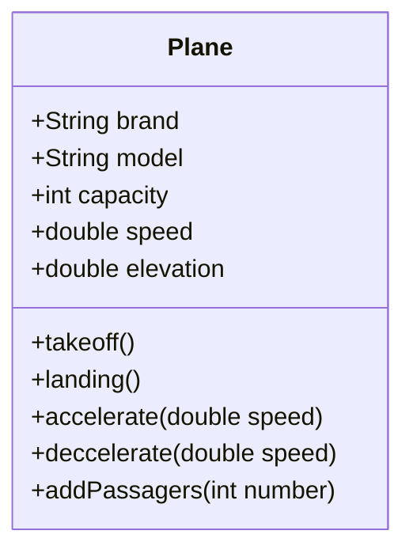

### Définir une classe

Pour définir une classe,  
- une classe est dans un fichier portant le même nom
- son nom commence par un majuscule et respecte le format pascalCase.
- elle est définie par le mot clé **class**
- elle posséde des propriétés, des constructeurs et des méthodes.

```java
public class AirPlane {

    // 1 déclaration des attributs / propriété
    private String brand;
    private String model;
    private int capacity;
    private double speed;
    private double elevation;

    //Les méthodes
    public void decelerate(double speeValued) {
        if (this.speed - speeValued > 0) {
            this.speed -= speeValued;
        }
    }

    public void accelerate(double speeValued) {
        this.speed += speeValued;
    }
}

```

### Les variables

Elément « nommé » permettant de stocker des informations sur la classe ou sur l’instance de la classe (objet)

Le tableau suivant présente les types de variables que vous pouvez rencontrer dans une classe.

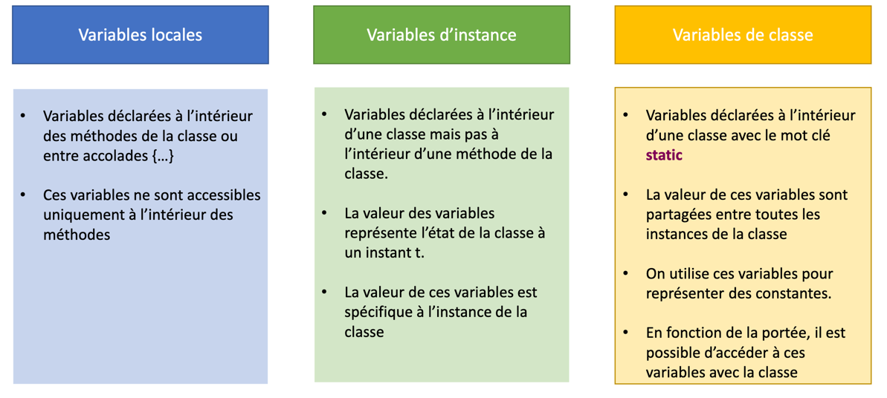

Concernant les variables d'instances, chaque instance possédera « ses » propres valeurs pour chaque propriété

> Pour créer une instance, il faut utiliser le mot clé **new** 

### Les constructeurs

Un constructeur est un bloc d'instructions permettant d'initialiser une nouvelle instance d'une classe.

Un constructeur : 
- porte le **même nom que la classe**
- retourne aucun type. 
- accéde au mot clé **this** qui représente l'instance de la classe
- sert à configurer l'état intial de l'instance

Une classe peut ne pas avoir de constructeur. Dans ce cas, Java configure automatiquement un constructeur par défaut ne réalisant aucun traitement. 
Les propriétés de l'instance seront initalisées par les valeurs par défaut.

Dés qu'un constructeur est défini, le constructeur par défaut n'est plus accéssible.

On peut définir autant de constructeurs que l'on souhaite. La différence se fera sur le nombre et le type des paramétres les définisant.

Pour notre classe **AirPlane**, le constructeur suivant initialisera la marque et le modele. Quant aux autres propriétés (speed...), elles seront initialisées par les valeurs par défaut.


```java
 public AirPlane(String brand, String model) {
        this.brand = brand;
        this.model = model;
    }
```


> le mot clé **this** permet d'accéder à l'instance de la classe c'est à dire à l'objet que nous sommes entrain d'initialiser. Suivi du **.**, il permet d'accéder aux propriétés et au méthodes de l'instance.
> le mot clé **this** sera disponible dés que l'on accéder à des méthodes d'instance.

La création d'une instance se fera par l'utilisation du mot clé **new** suivi du contructeur souhaité.

L'exemple suivant permet de définir 2 variables : a310 et b77. Ces 2 variables sont du type **AirPlane**.
Puis, nous initialisons les variables en appelant le contructeur prenant la marque et le modéle.

```java
public class Main1 {

    public static void main(String[] args) {
        AirPlane a310 = new AirPlane("Airbus", "A310");
        AirPlane b777 = new AirPlane("Boeing", "B777");
    }
}
```
Le mode débug de l'IDE permet de visualer ces 2 instances avec leurs propriétés respectives.

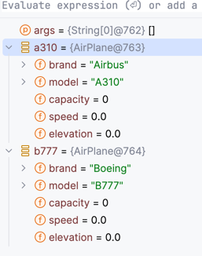


Le tableau suivant synthétise les 3 types de constructeurs :

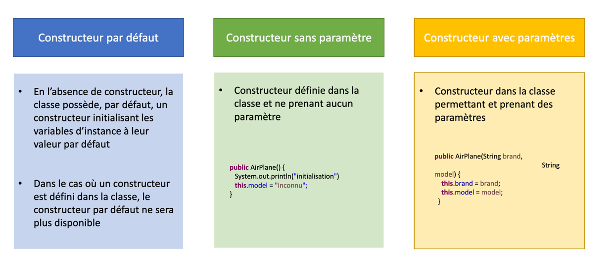

Il est tout à fait possible de déclarer autant de constructeurs que l'on souhaite.
Il s'agit du principe de l'overloading.

En ajoutant un constructeur avec uniquement la marque, nous pouvons créer des instances à partir de ce dernier.

```java
public AirPlane(String brand) {
    this.brand = brand;
}
```

```java
public class Main2 {

    public static void main(String[] args) {
        AirPlane a310 = new AirPlane("Airbus", "A310");
        AirPlane b777 = new AirPlane("Boeing");
    }
}
```

Le mode débug permet de visualiser que la variable *b777* ne posséde que la marque.

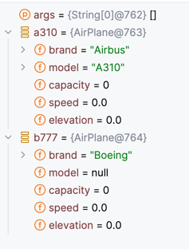

### Les méthodes

Les méthodes d'instance vont permette d'accéder à notre objet afin qu'il réalise un traitement. Ce traitement pourra modifier l'état de notre objet via la modification de la valeur des propriétés d'instance.

> L'accés à ces méthode se fera en utilisant le point.

L'exemple présente 2 méthodes qui vont agir sur la vitesse de l'instance.

```java
  public void decelerate(double speeValued) {
        if (this.speed - speeValued > 0) {
            this.speed -= speeValued;
        }
    }

    public void accelerate(double speeValued) {
        this.speed += speeValued;
    }
```


```java
public class Main3 {

    public static void main(String[] args) {
        AirPlane a310 = new AirPlane("Airbus", "A310");
        a310.accelerate(200);
        a310.decelerate(20);
    }
}
```

Le tableau montre l'évolution de la vitesse de l'instance **a310**.

 Etat 1                   | Etat 2                                    | Etat 3                                    |
 -------------------------|-------------------------------------------|-------------------------------------------|
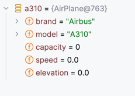 | 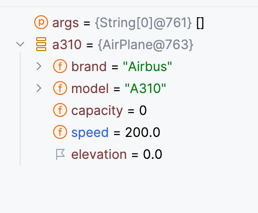 | 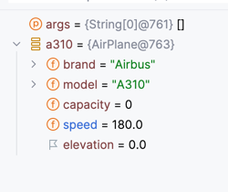

### Les accesseurs

La POO répose sur le principe d'encapsulation. 
Ce principe permet de masquer les détails d’un objet à un client. Afin d’accéder
aux propriétés, des méthodes d’accés sont créées afin de retourner ou de modifier
les propriétés de l’instance

Ainsi, 
* Les propriétés sont **privée** le plus souvent. Lors de leur déclaration, les propriétés de la classe sont préfixés par **private**. 
* Les propriétés privées ne sont accessible que les méthodes de l'instance
* L'accés et la modification des valeurs des propriétés seront le plus souvent réalisé par des méthodes appelées **getter** et **setter**.

En complétant la classe **AirPlane**, l'ajout d'un getter et d'un setter sur la propriété **model** permet de lui associer une valeur et d'y accéder.

```java
    public void setModel(String model) {
        this.model = model;
    }


    public int getCapacity() {
        return capacity;
    }
```

```java
public class Main4 {

    public static void main(String[] args) {
        AirPlane b777 = new AirPlane("Boeing");
        b777.setModel("B777");
        System.out.println("L'instance b777 est associée au modele : " + b777.getModel());
    }
}
```

```java
mvn --quiet compile exec:java -Dexec.mainClass=Main4
L'instance b777 est associée au modele : B777
```

Une erreur serait de mettre des setter dans toutes les classes. 
Hors, certaines propriétés ne doivent pas être modifiées sans contrôle.
Par exemple, la propriété **speed** ne doit être modifiée directement vu qu'elle est controlée par les méthodes **accelerate** et **decelerate**.

On ne permettra que la récupération de la valeur de la propriété **speed**.

```java
public double getSpeed() {
    return speed;
}
```

```java
public class Main5 {

    public static void main(String[] args) {
        AirPlane a310 = new AirPlane("Airbus", "A310");
        a310.accelerate(200);
        a310.decelerate(20);
        System.out.printf("Avion %s %s a une vitesse de %.2f \n", a310.getBrand(), a310.getModel(), a310.getSpeed());
    }
}
```

```java
mvn --quiet compile exec:java -Dexec.mainClass=Main5
Avion Airbus A310 a une vitesse de 180,00 
```

## L'héritage

L'héritage est la capacité d'une classe  d’être créée à partir d’une autre classe en l’étendant.
Ce principe permet d'éviter de dupliquer le code et de factoriser le code en commun dans une classe dite mère.

Les classes héritantes d'une autre classe héritent des comportements de la classe héritée. 

Les classes héritante sont dites des classes filles et peuvent définir : 
- de nouvelles propriétés
- de nouvelles méthodes.

Les classes fille peuvent également modifier le comportement de la classe mère en redefinissant les méthodes de la classe mère (**overriding**)

Exemple d'héritage : 


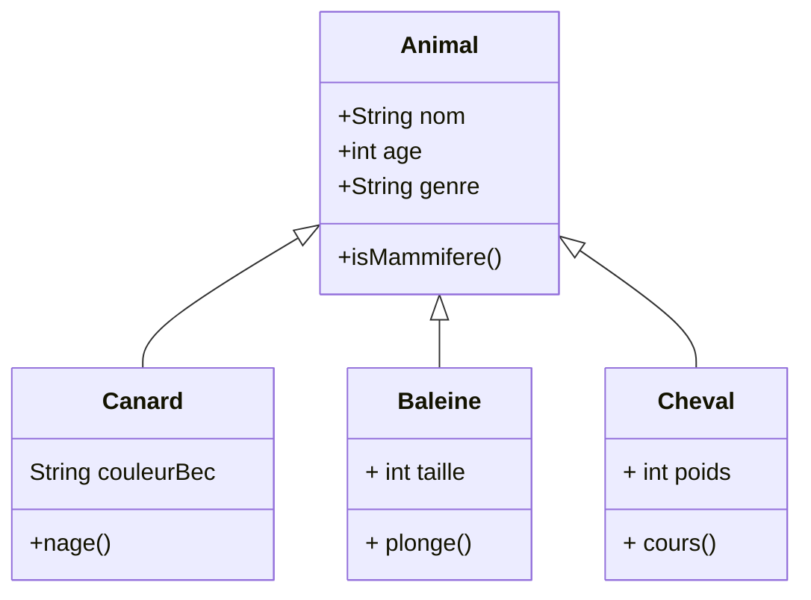

### Comment hériter ? 

En Java, une classe peut hériter d'une autre classe en utilisant le mot clé **extends**.
Le mot clé **extends** se place aprés le nom de classe et est suivi du nom de classe mère.

> Attention, une classe **ne peut hériter que d'une seule classe !**

Dans le cas des animaux : 


```java 
public class Animal  {
    private String nom;
    private int age;
    private String genre;

    public boolean isMammifere(){
        return false;
    }
}

public class Baleine extends Animal{
    private int taille;
    
    public void plonge(){

    }
}
```

Ici, nous constatons que la classe Baleine représente un mammifére. 
La méthode **isMammifere** de la classe doit être redefinie dans la classe **Baleine**.

Ainsi, la classe **Baleine** devient : 

```java
public class Baleine extends Animal{

    private int taille;

    public void plonge(){
    }

    @Override
    public boolean isMammifere() {
        return true;
    }
}
```

> Ici, vous voyez apparaitre l'annotation @override. Les annotations sont énormément utilisées dans le cadre de développement d'applications d'entreprise. Elles permettent d'ajouter des comportements transverses sans que vous soyez obligés de coder.
> L'annotation @override est purement indicative et n'a aucun apport lors de l'exécution.

### Le mot clé super

Au sein des classes fille, nous pouvons redefinir les méthodes. Cette redefinition peut cependant s'appuyer/utiliser ce qui a été initialement défini dans la classe mère.

Le mot clé **super** permet d'appeler les méthodes de la classe mère au sein d'une classe fille,

Par exmple, ajoutons une méthode **getNom** dans la classe **Animal**.Cette méthode permettra de fournir le nom de l'animal.

Dans le cas de la classe **Baleine**, nous souhaitons que la méthode **getNom** retourne le nom de la baleine en préfissant pas *Baleine*.

En recodant, nous obtenons : 

```java
public abstract class Animal {

    private String nom;
    private int age;
    private String genre;

    public Animal(String nom, int age) {
        this.nom = nom;
        this.age = age;
    }

    public String getNom() {
        return nom;
    }
}

public class Baleine extends Mammifere{

    private int taille;

    public Baleine(String nom, int age) {
        super(nom, age);
    }

    @Override
    public String getNom() {
        return "Baleine  " + super.getNom();
    }

    public void plonge(){
    }
}
```

```java
import animal.Baleine;

public class Main10 {
    public static void main(String[] args) {
        var baleine = new Baleine("Moby Dick", 173);
        System.out.println(baleine.getNom());
    }
}

```

```shell
Baleine Moby Dick
```

### Le mot clé **abstract**

Dans l'exemple ci dessus, aucun obligation n'a été imposé quant à la redéfinition de la méthode **isMammifere**. 
La classe **Balein** aurait très bien pu ne pas redéfinir cette méthode et d'un point de vue compilation et éxecution, aucune erreur n'aurait été rencontrée.

Et pourtant, conceptuellement, une **baleine** est un mammifère.

Le moté clé **abstract** permet de forcer la redefinition des méthodes dites abstraites par les classes héritantes.
Il doit être possitionné avec le mot clé **class** de la classe mère puis peut être utilisé lors de la déclaration de certaines méthodes. 

Ces méthodes abstraites ne fourniront aucun bloc de code dans la classe. Seule la siganture sera définie (ce que la méthode retourne et ce qu'elle prend en paramétre).

Les classes **fille** **devront** implémenter les méthodes abstraites. C'est à dire fournir un bloc d'instructions.

Voici la nouvelle déclaration de la classe **Animal** : 

```java 
public abstract class Animal  {

    private String nom;
    private int age;
    private String genre;

    public abstract boolean isMammifere();
}
```

Si nous ne faisons aucune autre modification, le projet ne compile plus.

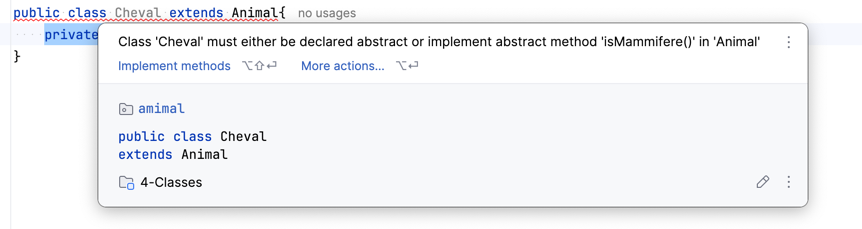

Il est nécessaire de définir une implémentation de cette méthode dans les classes **Cheval** et **Canard**

```java
public class Cheval extends Animal{
    private int poids;

    @Override
    public boolean isMammifere() {
        return true;
    }
}

public class Canard extends Animal {

    private String couleurBec;

    public void nage() {
    }

    @Override
    public boolean isMammifere() {
        return false;
    }
}
```

### Le mot clé final.

La méthode **isMammifere** va devoir être implémtée dans l'ensemble des classes représentant des animaux. 
Dans notre exemple, les classes **Cheval** et **Baleine** représentent des animaux tous 2 des mammiféres et potentiellement partageant des caractèristiques communes.

Ainsi, une nouvelle classe **Mammifere** peut être réalisé afin de regrouper les mammiféres entre eux.

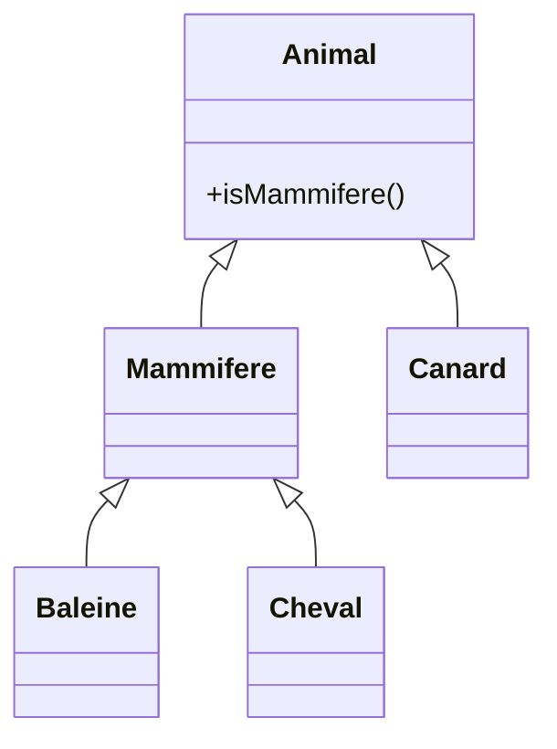

Le nouveau diagramme de classe présente le nouvel arbre d'héritage.

Dés lors, la méthode  **isMammifere** sera définie dans la classe **Mammifere** et ne devra plus être redéfinie par les classes héritant de la classe **Mammifere**.

Pour éviter qu'une méthode ne soit redéfinie, il suffit de la faire précéder par le mot clé **final**. Le mécanisme d'**overrriding** ne pourra plus avoir lieu.

La classe **Mammifere** devient : 

```java
public class Mammifere extends Animal{
    @Override
    public final boolean isMammifere() {
        return true;
    }
}
```

Si nous changeons l'heritage sur la classe **Baleine** en laissant la méthode **isMammifere**.


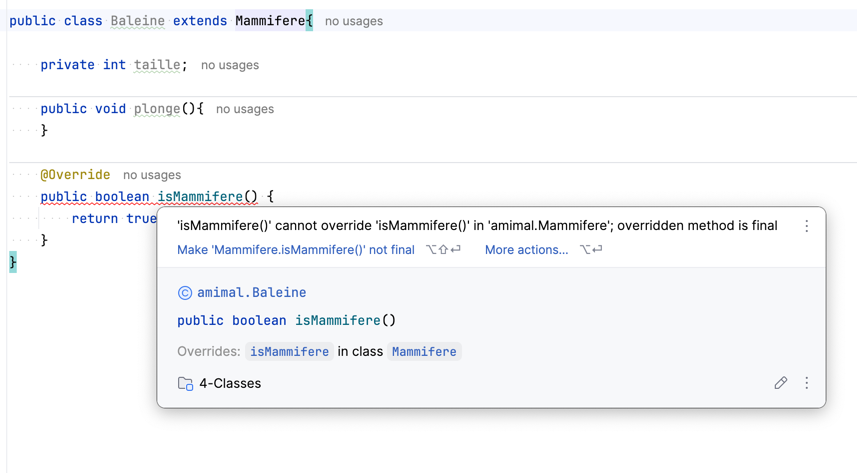

La classe **Baleine** doit devenir : 

```java
public class Baleine extends Mammifere{

    private int taille;

    public void plonge(){
    }

}
```

## La classe *java.lang.Object*

Toute classe étend directement ou indirectement de la classe *java.lang.Object* même si aucun héritage n'est indiqué.

Ainsi, les méthodes de la *java.lang.Object* sont disponibles.

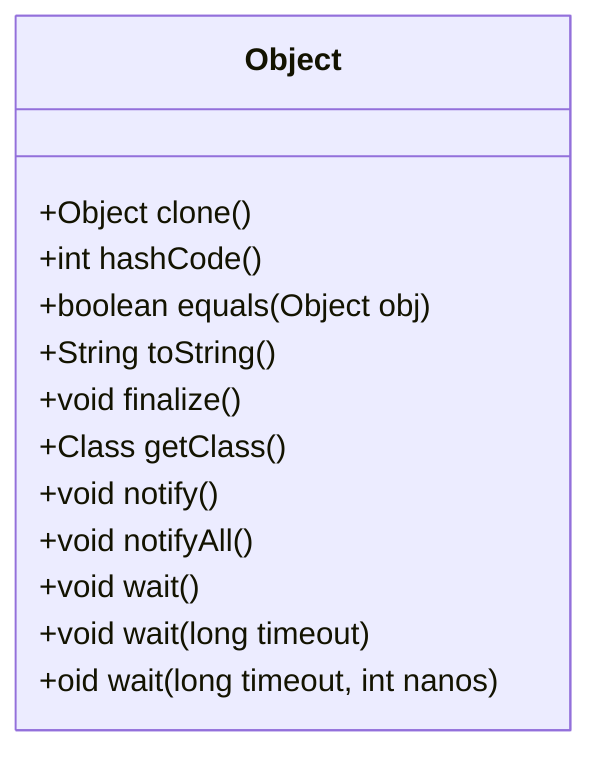

Attardons nous sur les méthodes principales.

### La méthode toString

Cette méthode permet de proposer une représentation de l'objet sour la forme d'une chaîne de caractères.

L'implémentation de la classe **Object** est très sommaire. Elle ne fournit que le nom de de la classe compléte de la valeur retounée par la méthode **hashcode**.

```java
import animal.Baleine;

public class Main6 {
    public static void main(String[] args) {
        var baleine = new Baleine("Moby Dick", 173);
        System.out.println(baleine);
    }
}
```

```shell
animal.Baleine@506e6d5e
```

> la méthode  System.out.println invoque directement la méthode **toString** lorsqu'elle recoit un objet en paramétre.

En redéfinissant la méthode **toString**, il serait plus intéressant d'afficher le nom et l'age de la baleigne.

Pour cela, redefinissons la méthode **toString** dans la classe **Animal**.

```java
package animal;

import java.util.StringJoiner;

public abstract class Animal {

    private String nom;
    private int age;
    private String genre;

    public Animal(String nom, int age) {
        this.nom = nom;
        this.age = age;
    }

    public abstract boolean isMammifere();

    @Override
    public String toString() {
        return new StringJoiner(", ", this.getClass().getSimpleName() + "[", "]")
                .add("age=" + age)
                .add("nom='" + nom + "'")
                .toString();
    }
}

```

En executant le programme précédent, l'affichage est désormais le suivant : 

```shell
mvn --quiet compile exec:java -Dexec.mainClass=Main6
Baleine[age=173, nom='Moby Dick']
```

### La méthode equals 

Cette méthode est fréquemment utilisée pour vérfier que 2 objets sont égaux. 

Par défaut, la méthode fournie pour la classe **java.lang.Object** vérifie uniquement que les 2 objets sont la même instance. 

```java 
public boolean equals(Object obj) {
    return (this == obj);
}
```

Si nous laissons l'implémentation, par défaut, le code suivant indique que les 2 baleines sont différents.
Hors, elles semblent cependant être identiques.

:
```java
public class Main7 {
    public static void main(String[] args) {
        var baleine1 = new Baleine("Moby Dick", 173);
        var baleine2 = new Baleine("Moby Dick", 173);
        System.out.printf("Les baleines sont elle les meêmes ? Reponse : %b", baleine1.equals(baleine2));
    }
}
```

Résulat :

```shell
Les baleines sont elle les mêmes ? Reponse : false
```

L'égalité entre 2 objets dans la réalité n'est pas uniquement basée sur le fait que ce soit la même instance. 
Il s'agit le plus souvent d'une comparaison entre les valeurs des propriétés caractèrisant chaque instance. 

Par exemple, dans la classe **Animal**, on pourrait considérer que 2 objets sont éqaux :
- soit les objets sont la même instance
- soit ils sont issus de la même classe et ont le même nom et le même age.

Ainsi, la classe **Animal** doit redéfinir la méthode **equals**.

```java
public abstract class Animal  {

    private String nom;
    private int age;
    private String genre;

    public Animal(String nom, int age) {
        this.nom = nom;
        this.age = age;
    }

    public abstract boolean isMammifere();

    @Override
    public boolean equals(Object o) {
        if (this == o) return true;
        if (o == null || getClass() != o.getClass()) return false;
        Animal animal = (Animal) o;
        return age == animal.age && Objects.equals(nom, animal.nom);
    }
    
    //Autres méthode
}
```

En éxecutant la méthode **main** précédente, on constate que l'éqalité deveint vraie.

```shell
Les baleines sont elle les mêmes ? Reponse : true
```

### La méthode hashCode

Cette méthode est utilisée par des algorithmes de hachage avant de vérifier que 2 objets sont égaux. 

Par exemple, la classe **HashSet** fréquemment utilisée lors de l'utilisation de **Set** utilise cette méthode avant de comparer les objets. 
Ainsi, des objets identiques doivent avoir en premier lieu le même résultat au niveau du Hashsode. 

> un set est une ensemble d'objets ne contenant pas de doublon.

Si nous conservons l'impléméntation de la méthode **equals** mais que nous ne redéfinisonns pas la méthode **hashCode**, nous constatons que le set contient **2 éléments**. 
Or, les 2 baleines étant les mêmes, un seul élément ne devrait être présent dans la set.

```java
public class Main8 {
    public static void main(String[] args) {
        var baleine1 = new Baleine("Moby Dick", 173);
        var baleine2 = new Baleine("Moby Dick", 173);

        Set<Animal> set = new HashSet<>();
        set.add(baleine1);
        set.add(baleine2);

        System.out.printf("Nombre d'éléments : %d",  set.size());
    }
}
```

```shell
Nombre d'éléments : 2
```

Il est donc nécessaire de redefinir la méthode **hashCode**. L'implementation de ce type méthode repose sur la réalisation d'une empreinte numérique en fonction des propriétés utilisées dans l'égalité.
Pour la classe **Animal**, l'implémentation serait la suivante : 

```java
public abstract class Animal  {

    private String nom;
    private int age;
    private String genre;

    public Animal(String nom, int age) {
        this.nom = nom;
        this.age = age;
    }

    public abstract boolean isMammifere();

    // methode equals
   
    @Override
    public int hashCode() {
        return Objects.hash(nom, age);
    }

    // methode toString

}
```

Si nous relançons le main précédent, nous obtenons bien le résutat attendu :

```shell
Nombre d'éléments : 1
```


## L'agrégation / La composition / L'association

Comme décrit une classe permet de définir de nouveaux type, ces nouveaux types peuvent ainsi être utilisés pour déclarer des propriétés.

L'association est le faut qu'un objet soit lié à un objet d'un autre classe.

L'agrégation et la composition sont le fait qu'un objet soit lié à plusieurs objets d'une autre classe. La composition implique en plus une appartenance. La destruction de l'objet contenant détruit les objets liés. 

Créons la classe **Zoo** qui va contenir un ensemble d'animaux. Cet ensemble est limité au maximun à 100 animaux.

Au niveau UML,

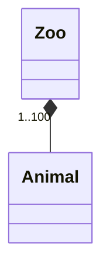

Au niveau de la classe **Zoo** : 

```java
public class Zoo {
    private Animal[] animaux;

    public Zoo() {
        this.animaux = new Animal[100];
    }

    public void addAnimal(Animal animal, int index){
        this.animaux[index] = animal;
    }

    @Override
    public String toString() {
        return new StringJoiner(", ", Zoo.class.getSimpleName() + "[", "]")
                .add("animaux=" + Arrays.stream(animaux)
                                    .filter(Objects::nonNull)
                                    .map(Object::toString)
                                    .collect(Collectors.joining(",")))
                .toString();
    }
}
```

La méthode **addAnimal** permet d'ajouter des animaux au sein de la classe **Zoo**.

```java
import animal.Baleine;
import animal.Canard;
import animal.Zoo;

public class Main9 {
    public static void main(String[] args) {
        Zoo zoo = new Zoo();
        zoo.addAnimal(new Baleine("Moby Dick", 173), 0);
        zoo.addAnimal(new Canard("Donald Duck", 90, "jaune"), 1);
        System.out.println(zoo);
    }
}
```

```shell
Zoo[animaux=Baleine[age=173, nom='Moby Dick'],Canard[age=90, nom='Donald Duck']]
```

> Vous pouvez constater que la méthode **addAnimal** prend 2 paramétres dont le premier est un paramétre de type Animal.
> Nous appelons cette méthode en passant une instance de la classe **Baleine** puis une instance de la classe **Canard**.. 
> Aucune erreur est lévée ce qui est tout à fait normal, les classes **Baleine** et **Canard** héritent toutes 2 de la classe **Animal**. 
> Donc, toute instance de ces classes sont, par héritage, des instances de la classe **Animal**. On parle ici de polymorphisme.  

<div style="page-break-before: always"> </div>

# Les interfaces

## Introduction

Une interface est un prototype de classe définissant des méthodes devant être
implémentées par les classes réalisant ce prototype.

En java, une interface est introduit par le mot clé **interface**.

Une interface peut contenir :
* Des signatures de méthodes
* Des variables avec « public static final »

Une classe peut implémenter plusieurs interfaces via le mot clé ** implements**

Une interface peut étendre plusieurs interfaces via le mot clés **extends**

## Declaration

Fichier [AutoRoute](src/main/java/AutoRoute.java)

```java
public interface AutoRoute {

    /**
     * retourne la categorie afin de calculer le prix du péage
     *
     * @return
     */
    int getCategorie();
}
```

Fichier [PoidsLourd](src/main/java/PoidsLourd.java)
```java
public class PoidsLourd extends Vehicule
        implements AutoRoute {

    public PoidsLourd(String modele, int nbEssieux) {
        super(modele, nbEssieux);
    }

    @Override
    public int getCategorie() {
        return 2;
    }
}
```

Fichier [Voiture](src/main/java/Voiture.java)
```java
public class Voiture extends Vehicule
        implements AutoRoute {

    public Voiture( String modele, int nbEssieux) {
        super(modele, nbEssieux);
    }
    @Override
    public int getCategorie() {
        return 1;
    }
}
```

Ainsi, les classes **Voiture** et **PoidsLourd** implémentent l'interface **AutoRoute**. 
On a l'obligation de définir la méthode **getCategorie()**.

## Les méthodes par défaut

Depuis Java 8, on peut avoir de méthodes **avec une implémentation** exploitant les méthodes de l’interface.
La méthode doit être préfixée par le mot clé **default**.

Si nous reprenons l'interface **AutoRoute**, nous pouvons ajouter la méthode **calulerPrixPeage** qui sera une méthode par défaut utilisant la catégorie du vehicule afin de caluler un prix.

```java
public interface AutoRoute {

    /**
     * retourne la categorie afin de calculer le prix du péage
     *
     * @return
     */
    int getCategorie();

    /**
     * calcule le prix du péage.
     *
     * @return prix du péage
     */
    default double calulerPrixPeage(){
        return getCategorie() * 15;
    }
}

```

Les classes **PoidsLourd** et **Voiture** ne sont pas obligées de fournir une implémentation à la méthode **calulerPrixPeage**

> Ainsi, il est désormais possible d'ajouter de nouvelles méthodes sur des interfaces sans que cela n'impacte la compilation des applications. 
> Ce nouveau concept a ainsi permis d'intégrer la philosophie des streams au niveau des collections tout en conservant la rétro compatibilité des classes existantes.liées aux collections.

<div style="page-break-before: always"> </div>

# Les collections

-----

## Qu'est ce qu'une collection ? 

Une collection est une structure de données permettant de regrouper un
ensemble d’objets.

Une collection peut etre comparée à un tableau avec des avantages indéniables : 
- aucune contrainte de taille. La liste s'adapte automatiquement en cachant la complexité sous jacente.
- de nombreuses méthodes permettant de manipuler les élements de la collection.
  - Ajout, suppression, recherche
  - Parcours
  - Tri

Les classes permettant de créer des collections sont essentiellement dans le package *java.util*.

Le JDK fournit diverses implémentations répondant à des besoins différents et adaptés à des contextes d'utilisation.

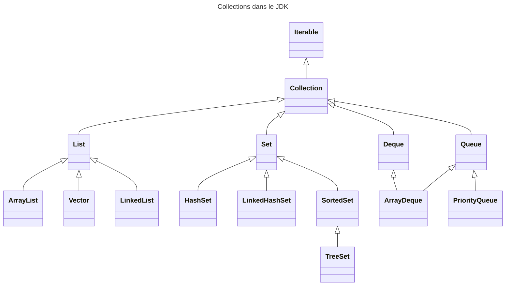

## Les grandes familles de collections

| List                                                           | Set                                                       | Queue
|----------------------------------------------------------------|-----------------------------------------------------------|-------------------------------------
| *java.util.List*                                               | *java.util.Set*                                           | *java.util.Queue*
| Liste ordonnée d’objets                                        | Liste non ordonnée d’objets                               | Liste ordonnée d’objets type FIFO
| Possibilité d’avoir des  doublons                              | Aucun doublon                                             | Possibilité d’avoir desdoublons
| Possibilité de placer un élément à un index précis de la liste | Pas possibilité de placer un élément à l’endroit souhaité | Tout nouvel élément est placé à la fin de la liste
| Accès possible à un élément par son index                      |                                                           | Accès uniquement au premier élément

### L'interface List

3 implémentations principalement utilisées :

* ArrayList<E>
  * Bonne performance en  accès get / set
  * **Classe la plus utilisée**
  

* LinkedList<E>
  * Bonne performance en accès add / remove
  * Performance médiocre en accès get / set


* Vector<E>
  * Toutes les méthodes sont synchronisées
  * Performance médiocre
  * **Classe à ne plus utiliser**

Quelques méthodes fréquemment utilisées : 

| Methode                                | Description                                                        |
|----------------------------------------|--------------------------------------------------------------------|
| `boolean add(E e)`                     | Permet d’ajouter un élément                                        | 
| `void add(int index, E element)`       | Permet d’ajouter un élément à l’index                              |
| `E get(int index)`                     | Permet de récupérer un élément dans la liste à partir de son index |
| `boolean remove(Object o)`             | Permet de supprimer un élément.                                    |
| `int size()`                           | Retourne la taille de la liste                                     |
| `boolean isEmpty()`                    | Indique si la liste est vide                                       |
| `void sort(Comparator<? super E> c)`   | Permet de trier la liste en se basant sur unComparator             |

Fichier [Main1](src/main/java/Main1.java)

```java
import java.util.ArrayList;
import java.util.List;

public class Main1 {

    public static void main(String[] args) {
        List<String> list = new ArrayList<>();
        list.add("pomme");
        list.add("melon");
        list.add("orange");
        list.add("cerise");
        list.add("fraise");
        String pomme = list.get(0);
        System.out.println(pomme);
        System.out.printf("Taille : %d\n", list.size());
        String orange = list.remove(2);
        System.out.println(orange);
        System.out.printf("Taille : %d", list.size());
    }
}
```

```shell
mvn --quiet compile exec:java -Dexec.mainClass=Main1
pomme
Taille : 5
orange
Taille : 4
```

> L'interface **List** posséde des méthodes statiques *List.of* permettant facilement d'initialiser des listes d'élements.
> Attention, la liste créée est immutable. C'est à dire que vous ne pouvez ni ajouter, ni supprimer des élements.

L'exemple suivant exploite la méthode *List.of* afin d'initialiser une liste de fruits directement remplie.


```java
import java.util.List;

public class Main2 {
    public static void main(String[] args) {
        List<String> list = List.of("pomme", "melon", "orange", "cerise", "fraise");
        System.out.println(list);
    }
}
```

```shell
mvn --quiet compile exec:java -Dexec.mainClass=Main2
[pomme, melon, orange, cerise, fraise]
```

### L'interface Set

Un set ressemble fortement à une liste. Cependant, les sets n'ont pas de doublons.

* HashSet<E>
  * Classe les éléments à partir de la valeur du hashcode.
  * Seulement 1 élément « null »


* LinkedHashSet<E>
  * Comme le HashSet mais en conservant l’ordre d’insertion


* TreeSet<E>
  * Classe les éléments en réalisant un tri avec un ordre ascendant
  * Pour optimiser le tri
    * soit les éléments implémentent Comparable
    * soit un comparateur est passé au constructeur de la classe TreeSet

> Pour supprimer les doublons, Java va tester l'équalité des objets en utilisant la méthode **equals**. 
> Il est donc important de correctement définir l'équalité des objets d'une même classe.

> Le test d'équalité sur chaque objet du set pouvant être couteux en mémmoire, les implémentations de l'interface Set utlisent la méthode hashCode pour calculer l'empreinte avant de comparer l'équalité. 
>> Ainsi, dés que vous insérerez un objet dans le set, lors de l'insertion, la méthode hashCode est appelée afin d'obtenir une empreinte numérique. A partir de cette empreinte, l'impplémentation va rechercher la présence d'un objet ayant la même empreinte, si c'est le cas, il y aura un appel à la méthode equals. Si la méthode retourne vraie, l'objet inséré remplacera l'objet présent. Si non, l'objet sera ajouté à la lise.

Fichier [Main3](src/main/java/Main3.java)

```java
import java.util.HashSet;
import java.util.Set;

public class Main3 {
    public static void main(String[] args) {
        Set<String> set = new HashSet<>();
        set.add("pomme");
        set.add("pomme");
        set.add("melon");
        set.add("orange");
        set.add("cerise");
        set.add("fraise");
        System.out.println(set.isEmpty());
        System.out.printf("Taille : %d\n", set.size());
    }
}
```

```shell
mvn --quiet compile exec:java -Dexec.mainClass=Main3
false
Taille : 5
```

> L'interface **Set** posséde également des méthodes statiques *Set.of* permettant facilement d'initialiser un set d'élements.

```java
import java.util.List;
import java.util.Set;

public class Main4 {
    public static void main(String[] args) {
        Set<String> set = Set.of("pomme", "melon", "orange", "cerise", "fraise");
        System.out.println(set);
    }
}
```

```shell
mvn --quiet compile exec:java -Dexec.mainClass=Main4
[fraise, melon, orange, cerise, pomme]
```

### L'interface Queue

* PriorityQueue
  * Permet de récupérer les éléments triés après leur insertion

* ConcurrentLinkedQueue
  * Classe thread-safe
  * Adapté pour des accès dans un environnement multi-threadé

* ArrayBlockingQueue
  * Permet de stocker des éléments avec une taille finie
  * Eléments stockées en mode FIFO

| Méthode            | Description                                                                                             |
|--------------------|---------------------------------------------------------------------------------------------------------|
| boolean add(E e)   | Permet d’ajouter un élément mais lève une exception en cas de rejet de l’ajout                          |
| boolean offer(E e) | Permet d’ajouter un élément mais ne lèvera pas d’exception en cas de rejet de l’ajout                   |
| E remove()         | Permet de supprimer un élément de la queue. Lève une exception en cas de problème                       |
| E poll()           | Permet de supprimer un élément de la queue. Ne lève pas d’ exception en cas de problème                 |
| E element()        | Permet de récupérer un élement sans le retirer de la queue. Lève une exception en cas de problème       |
| E peek()           | Permet de récupérer un élement sans le retirer de la queue. Ne lève pas d’ exception en cas de problème |

## Parcourir une collection

### Utilisation du for

Depuis Java 5, le parcours des élements itérables a été facilité par l'utilisation du for ("for each").

> Un  tableau est également considéré comme un élement itérable. La syntaxe ci-dessous est également utilisable avec les tableaux.

Syntaxe : 

```java 
for(<Type> <variable> : <iterable>){
// instructions
}
`````

```java
import java.util.ArrayList;

public class Main5 {

    public record Country(String name, String capital){};

    public static void main(String[] args) {
        var countries = new ArrayList<Country>();
        countries.add(new Country("France", "Paris"));
        countries.add(new Country("Allemagne", "Berlin"));
        countries.add(new Country("Anglaterre", "Londres"));
        countries.add(new Country("Belgique", "Bruxelles"));

        for(var country:countries){
            System.out.println(country.name.toUpperCase() + " a pour capitale "+ country.capital);
        }
    }
}
```

```shell
mvn --quiet compile exec:java -Dexec.mainClass=Main5
FRANCE a pour capitale Paris
ALLEMAGNE a pour capitale Berlin
ANGLATERRE a pour capitale Londres
BELGIQUE a pour capitale Bruxelles
```

### Les streams et foreach

Depuis Java 8, la programmation fonctionnelle a fait son apparition au sein du langage Java.

La programmtion fonctionnelle a pour objetif d'appliquer des transformations (via l' 'utilisation des fonctions) sur des élements afin d'obtenir d'autres élements.

Les streams et les lambdas ont ainsi été intégrées dans le JDK pour mettre en place ce concept.

Ainsi, les collections possédent une méthode *stream* permettant d'initialiser la stream de la collection. 

Sur la stream obtenue, la méthode **foreach** est disponible et sera appelée sur chaque élement constituant la collection.

```java
import java.util.ArrayList;

public class Main6 {
    public record Country(String name, String capital){};

    public static void main(String[] args) {
        var countries = new ArrayList<Main5.Country>();
        countries.add(new Main5.Country("France", "Paris"));
        countries.add(new Main5.Country("Allemagne", "Berlin"));
        countries.add(new Main5.Country("Anglaterre", "Londres"));
        countries.add(new Main5.Country("Belgique", "Bruxelles"));

        countries.stream()
                .forEach(country -> System.out.println(country.name().toUpperCase() + " a pour capitale " + country.capital()));
    }
}

```

```shell
mvn --quiet compile exec:java -Dexec.mainClass=Main6
FRANCE a pour capitale Paris
ALLEMAGNE a pour capitale Berlin
ANGLATERRE a pour capitale Londres
BELGIQUE a pour capitale Bruxelles
```


<div style="page-break-before: always"> </div>


# Les streams & Les lambdas

-----

Depuis Java 8, la programmation fonctionnelle a fait son apparition au sein du langage Java.

La programmtion fonctionnelle a pour objetif d'appliquer des transformations (via l' 'utilisation des fonctions) sur des élements afin d'obtenir d'autres élements.

Les streams et les lambdas ont ainsi été intégrées dans le JDK pour mettre en place ce concept.

## Les lambdas

Depuis Java 8, les lambdas sont la fonctionnalité la plus important depuis Java5
* Evite de faire des classes anonymes
* Permet de réaliser de la programmation fonctionnelle
* Evite d’écrire du code inutile.

Syntaxe :
```
(parameter) -> //unique instruction

(parameter) -> {
 //instructions
}
```
Les instructions d'une lambda doivent être trés courtes. Le plus souvent, une seule ligne d'instruction constitue le corps de la lambda.

> Les accolades ne sont pas obligatoire. 
> Dans ce cas, une seule ligne d’instruction, ne se terminant pas par un point-virgule et dont le résultat de l’instruction est considéré comme la valeur de retour

```java
import java.time.LocalDate;
import java.time.LocalTime;
import java.util.Arrays;
import java.util.Comparator;
import java.util.List;
import java.util.StringJoiner;
import java.util.stream.Collectors;

public class Main1 {

    static class Personne{
        String nom;
        LocalDate dateNaissance;

        public Personne(String nom, LocalDate dateNaissance) {
            this.nom = nom;
            this.dateNaissance = dateNaissance;
        }

        @Override
        public String toString() {
            return nom + " - " + dateNaissance;
        }
        
        public LocalDate getDateNaissance() {
          return dateNaissance;
        }
  
        public String getNom() {
          return nom;
        }
    }

    public static void main(String[] args) {

        Personne donald = new Personne("donald", LocalDate.parse("1934-01-01"));
        Personne mickey = new Personne("mickey", LocalDate.parse("1928-01-01"));
        Personne dingo = new Personne("dingo", LocalDate.parse("1932-05-25"));
        List<Personne> personnages = Arrays.asList(donald, mickey, dingo);

        Comparator<Personne> compare = (p1, p2) -> p1.dateNaissance.compareTo(p2.dateNaissance);
        personnages.sort(compare);

        System.out.println(personnages);
    }
}

```

### Les méthodes d'inférence

Il est fréquent qu'une lambda n'est simplement que l'application d'une transformation, d'une comparaison sur une propriété.
Il est possible de passer uniquement que la fonction. Celle ci sera appliquées sur tous les élements. 

Pour ne passer qu'une méthode, on indique uniquement où elle se trouve en utilisant **::** au lieu du point.

```java
import java.time.LocalDate;
import java.util.Arrays;
import java.util.Comparator;
import java.util.List;

public class Main2 {
    public static void main(String[] args) {
        Main1.Personne donald = new Main1.Personne("donald", LocalDate.parse("1934-01-01"));
        Main1.Personne mickey = new Main1.Personne("mickey", LocalDate.parse("1928-01-01"));
        Main1.Personne dingo = new Main1.Personne("dingo", LocalDate.parse("1932-05-25"));
        List<Main1.Personne> personnages = Arrays.asList(donald, mickey, dingo);

        Comparator<Main1.Personne> compare = Comparator.comparing(Main1.Personne::getDateNaissance);

        personnages.sort(compare);

        System.out.println(personnages);
    }
}


```

> La méthode static **Comparator.comparing** prend en parématre un méthode dont le but est de fournir une valeur pour la comparer.

```java
    public static <T, U extends Comparable<? super U>> Comparator<T> comparing(
            Function<? super T, ? extends U> keyExtractor)
```

L'interface Function est une interface fonctionnelle prenant un élément en entrée et fournissant un valeur en retour.

Ainsi, nous passons la méthode **Main1.Personne::getDateNaissance**. 

A l'execution, la jvm va :
- invoquer la méthode getDateNaissance sur les élements de la liste afin de récupérer la date de naissance
- comparer des couples de date de naissance afin de classes les objets.

## Les streams

Une stream ;
* Permet de mieux interagir avec des collections de données
* Permet de chainer des transformations sur une collection
* S’appuie sur un nouveau concept : lambda
* Support la programmation fonctionnelle
    * Transformer des objets
    * Eviter les effets de bord

Un stream c’est 3 élements :
* Une source de données (la collection …)
* Des transformations
* Une opération terminale


```java
import java.util.ArrayList;

public class Main6 {
    public record Country(String name, String capital){};

    public static void main(String[] args) {
        var countries = new ArrayList<Main5.Country>();
        countries.add(new Main5.Country("France", "Paris"));
        countries.add(new Main5.Country("Allemagne", "Berlin"));
        countries.add(new Main5.Country("Anglaterre", "Londres"));
        countries.add(new Main5.Country("Belgique", "Bruxelles"));

        countries.stream()
                .forEach(country -> System.out.println(country.name().toUpperCase() + " a pour capitale " + country.capital()));
    }
}

```

```shell
mvn --quiet compile exec:java -Dexec.mainClass=Main6
FRANCE a pour capitale Paris
ALLEMAGNE a pour capitale Berlin
ANGLATERRE a pour capitale Londres
BELGIQUE a pour capitale Bruxelles
```

Une transformation applique la transformation sur chaque élement de la stream et retourne une autre stream

| Transformation                                    | Description                                           |
|---------------------------------------------------|-------------------------------------------------------|
| filter                                            | Permet de filtrer les données                         |
| map <br/>mapToInt <br/>mapToLong <br/>mapToDouble | Permet de réaliser une transformation de la données   |
| reduce                                            | Réaliser une réduction sur les éléments de la streams |
| distinct                                          | Supprime tous les éléments en double                  |
| skip                                              | Permet de sauter un certain nombre d’éléments         |
| limit                                             | Permet de réduire le nombre d’éléments de la Stream   |
| sorted                                            | Permet de trier les éléments                          |


Par exmple, reprenons l'exemple précédent, et créons la chaine de caractéres avant la sortie console

### La transformation  avec map

```java
import java.util.ArrayList;

public class Main7 {
    public record Country(String name, String capital){};

    public static void main(String[] args) {
        var countries = new ArrayList<Main5.Country>();
        countries.add(new Main5.Country("France", "Paris"));
        countries.add(new Main5.Country("Allemagne", "Berlin"));
        countries.add(new Main5.Country("Anglaterre", "Londres"));
        countries.add(new Main5.Country("Belgique", "Bruxelles"));

        countries.stream()
                .map(country -> country.name().toUpperCase() + " a pour capitale " + country.capital())
                .forEach(str -> System.out.println(str));
    }
}

```

### Le filtre

Le filtre introduit par **filter** permet d'extraire les élements dont le filtre retourne **true**.

```java
import java.util.ArrayList;

public class Main8 {
public record Country(String name, String capital){};

    public static void main(String[] args) {
        var countries = new ArrayList<Main5.Country>();
        countries.add(new Main5.Country("France", "Paris"));
        countries.add(new Main5.Country("Allemagne", "Berlin"));
        countries.add(new Main5.Country("Anglaterre", "Londres"));
        countries.add(new Main5.Country("Belgique", "Bruxelles"));

        countries.stream()
                .filter(country -> country.name().startsWith("A"))
                .map(country -> country.name().toUpperCase() + " a pour capitale " + country.capital())
                .forEach(str -> System.out.println(str));
    }
}
```

### Le tri

Le tri est réalisé par la méthode **sorted**. En ne passant de paramétres, les éléments seront triés si ils sont comparable.

Il est également possible de passer une instance de la classe Comparator afin de permettre de comparer les élements entre eux.

```java
import java.util.ArrayList;

public class Main9 {
    public record Country(String name, String capital){};

    public static void main(String[] args) {
        var countries = new ArrayList<Main5.Country>();
        countries.add(new Main5.Country("France", "Paris"));
        countries.add(new Main5.Country("Allemagne", "Berlin"));
        countries.add(new Main5.Country("Anglaterre", "Londres"));
        countries.add(new Main5.Country("Belgique", "Bruxelles"));

        countries.stream()
                .sorted((c1, c2) -> c1.name().compareToIgnoreCase(c2.name()))
                .map(country -> country.name().toUpperCase() + " a pour capitale " + country.capital())
                .forEach(str -> System.out.println(str));
    }
}

```

## Les terminaisons

Les terminaisons ne retournent pas de streams.

Le chainage d’altération est interrompu

| Methode   | Description                                                                                              |
|-----------|----------------------------------------------------------------------------------------------------------|
| findFirst | Retourne le 1er éléments de la stream                                                                    |                       
| allMatch  | Retourne true si tous les éléments de la stream valide le predicat                                       |   
| noneMatch | Retourne true si au moins un des éléments de la stream valide le predicat                                |
| anyMatch  | Retourne true si aucun éléments de la stream valide le predicat                                          |     
| count     | Retourne le nombre d’éléments de la stream                                                               |           
| max       | Retourne l’élément maximal de la stream (utilisation de comparateur)                                     |
| min       | Retourne l’élément minimal de la stream (utilisation de comparateur)                                     |
| toArray   | Convertit les élements de la stream en un tableau                                                        |
| collect   | Permet de collecter les élements de la stream et de les récupérer sous la format d’une liste, d’un set…  |


```java 
import java.util.ArrayList;

public class Main10 {
    public record Country(String name, String capital){};

    public static void main(String[] args) {
        var countries = new ArrayList<Main10.Country>();
        countries.add(new Main10.Country("France", "Paris"));
        countries.add(new Main10.Country("Allemagne", "Berlin"));
        countries.add(new Main10.Country("Anglaterre", "Londres"));
        countries.add(new Main10.Country("Belgique", "Bruxelles"));

        var firstItem = countries.stream()
                .sorted((c1, c2) -> c1.name().compareToIgnoreCase(c2.name()))
                .findFirst();

        if(firstItem.isPresent()){
            var country = firstItem.get();
            System.out.println("Pays : " + country.name + ", Capitale : " + country.capital());
        }
    }
}
```


<div style="page-break-before: always"> </div>

# Les enum

Les énumerations sont une nouveau type apparu depuis Java 5. 
Elles permettent de representer une liste fini d'élements.

## Les caractèristiques
Les énum peuvent être déclarées à l'intérieur ou à l'extérieur des classes. Elle est définie par le mot clé **enum**. 

Une énumération contient une liste de valeurs figées lors de la compilation. Chaque valeur représent une instance de l'énum.

Une énumération ne peut être altérée lors de l'execution. Elle est implicitement **static** et **final**.

Resemblant à une classe, les contructeurs présents à l'intérieur de l'énumeration ne sont pas accéssible depuis l'extérieur. 
Uniquement les valeurs définies dans l'énumeration pourront accéder aux divers constructeurs.

Une énumaration est **immutable**

## Déclaration

Fichier [Saison](src/main/java/Saison.java)

```java
public enum Saison {
    PRINTEMPS,    // represente les différents valeurs de l'énum Saison
    ETE,
    AUTOMNE,
    HIVER
}
```

Les énurations posséde la méthode **values()** permettant de récupérer un tableau des valeurs constituant l'enumération.

Les valeurs de l'énumeration sont des constantes pointant chacune vers un emplacement mémoire spécifique qui ne changera pas pendant l"execution. Ainsi, on peut comparer les énumerations directement avec le comparateur **==**

Fichier [Exemple1](src/main/java/Exemple1.java)

```java
public class Exemple1 {
    public static void main(String[] args) {
        var saisons = Saison.values();
        for (Saison s : saisons) {
            System.out.println(s);
        }

        var saison = Saison.AUTOMNE; //resolution pqr une valeur de l'énumération

        var automne = Saison.valueOf("AUTOMNE"); // résolution par le nom

        if(saison == Saison.AUTOMNE) {
            System.out.println("C'est bien l'automne");
        }
    }
}

```

```shell
mvn --quiet compile exec:java -Dexec.mainClass=Exemple1
PRINTEMPS
ETE
AUTOMNE
HIVER
C'est bien l'automne
```

## Personnalisation d'une enum

Une énumération peut avoir des propriétés

L’initialisation des propriétés est réalisée via un constructeur

Afin de respecter le principe de l’énum, ces propriétés :
* ne doivent pas être modifiable
* Accessible qu’en lecture

Un constructeur n’est utilisable qu’à l’intérieur de l’enum.

Fichier [Exemple2](src/main/java/Exemple2.java)

```java
public class Exemple2{

    enum ColorPanel {
        RED("#FF0000"), GREEN("#FF0000"),
        LIGHT_GREEN("#90EE90"), BLUE("#0000FF");
        private final String hexaCode;

        ColorPanel(String hexaCode) {
            this.hexaCode = hexaCode;
        }
        /**
         * @return the hexaCode
         */
        public String getHexaCode() {
            return hexaCode;
        }

        @Override
        public String toString() {
            return super.toString() + "["+ hexaCode + "]";
        }
    }

    public static void main(String[] args) {
        ColorPanel c = ColorPanel.BLUE;
        System.out.println(c.getHexaCode());
        System.out.println(c);
    }
    
}
```

```shell
mvn --quiet compile exec:java -Dexec.mainClass=Exemple2
#0000FF
BLUE[#0000FF]
```

## Utilisation du switch case

Les énumérations peuvent être utilisées avec le classique swicth case.

Fichier [Exemple3](src/main/java/Exemple3.java)

```java
public class Exemple3 {

    public static void main(String[] args) {
        var saison = Saison.ETE;

        switch (saison) {
            case AUTOMNE:
                System.out.println("C'est l'automne");
                break;
            case HIVER:
                System.out.println("C'est hivers");
                break;
            case PRINTEMPS:
                System.out.println("C'est le printemps");
                break;
            case ETE:
                System.out.println("C'est l'été");
                break;
        }
    }
}

```

```shell
mvn --quiet compile exec:java -Dexec.mainClass=Exemple3
C'est l'été
```


<div style="page-break-before: always"> </div>

# Les Exceptions

## Introduction

Evénement intervenant lors de l’exécution d’un programme qui interrompt le flow
d’instructions normales d’un programme.


Les exceptions entraine une interruption dans le programme

En java, une **Exception** est une classe étendant la classe **Throwable**

## Classe Throwable

La classe **Throwable** est la classe de base de toutes les exceptions.


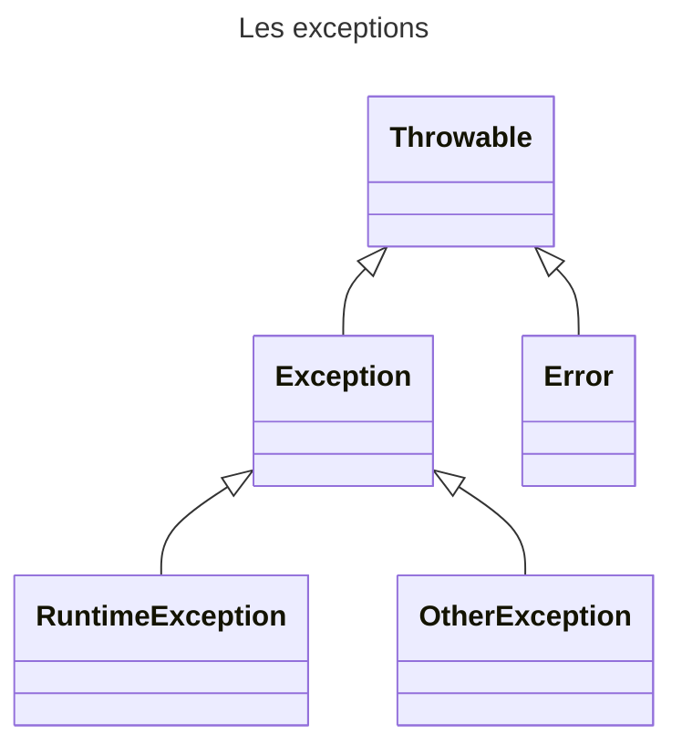

Les méthodes suivants sont disponibles :

| Méthode                | Description                                             |
|------------------------|---------------------------------------------------------|
| String getMessage()    | Retourne le message de l’exception                      |
| void printStackTrace() | Affiche l’exception avec l’état de la pile (« stack »). |
| Throwable getCause()   | Retourne l’origine de l’erreur                          |

## Classe Error

La classe **Error** est la classe représentant une erreur grave en provenance de la JVM ou d’un de ses composants

Cette erreur entraine un arrêt du programme


> Vous ne devez pas étendre de la classe Error

> Vous ne devez pas intercepter ces exceptions. Lorsqu'une exception de ce type est levée, votre application aura de forte chance d'être totalement instable.

## Classe RuntimeException

Le classe **RuntimeException** est la classe dont les exceptions ne sont pas obligatoirement interceptées par « try catch »

Ces exceptions peuvent être levées sans que la méthode l’indique via le
mot clé « throws ». 

On parle d’exception implicite

Exemple :
- NullPointerException
- ArrayIndexOutOfBoundsException


## Classe **Exception**
La classe **Exception** est la classe représentant les erreurs classiques remontées le plus souvent par les méthodes

Ces exceptions doivent être interceptées par le bloc « try catch »

## Créer son exception

Pour créer de nouvelles exceptions, il suffit d’étendre la classe **Exception**.
```java
package fr.epsi.exception;

public class UserNotFoundException extends Exception{
    public UserNotFoundException() {
        super("Utilisateur non trouvé");
    }

    public UserNotFoundException(Long identifer) {
        super("Utilisateur %d non trouvé".formatted(identifer));
    }
}
```

Par convention, les exceptions sont suffixées par le mot « Exception »


## Utilisation d'un exception : Le mot clé throws 

Pour indiquer qu’une méthode peut « lever » une exception, il faut utiliser le mot clé **throws** suivi de l'ensemble des exceptions pouvant être lévées.
Les exceptions sont séparées par une virgule. Ce mot clé est à possitionner à la suite des paramaétres de la méthode.

Pour lever l’exception, le mot clé « throw » doit être utilisé suivi d’une instance de la classe d’exception.

La levée de l’exception entraine une interruption de la méthode.

Dans le cas de l'exemple suivant, on constate que dans le cas où l'utilisateur n'est pas trouvé, l'exception **UserNotFoundException** sera levée par la méthode.

```java 
public class UserService {

    private Map<Long, User> users = Map.of(
            1l, new User(1l, "Donald", "Duck"),
            2l, new User(2l, "Mickey", "Mouse"),
            3l, new User(3l, "Peter", "Pan"),
            4l, new User(4l, "Mini", "Mouse")
    );

    public User findUserById(Long identifier) throws UserNotFoundException{
        User user = this.users.get(identifier);
        if(user == null) {
            throw new UserNotFoundException(identifier);
        }
        return user;
    }

}
```


<div style="page-break-before: always"> </div>

